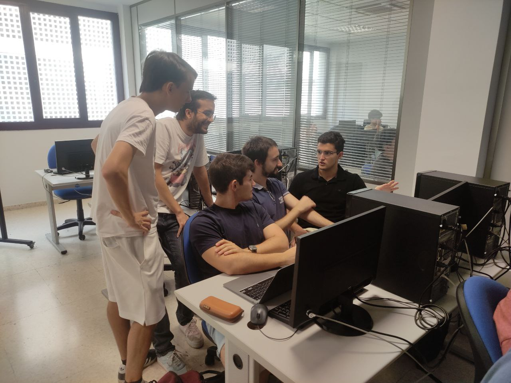
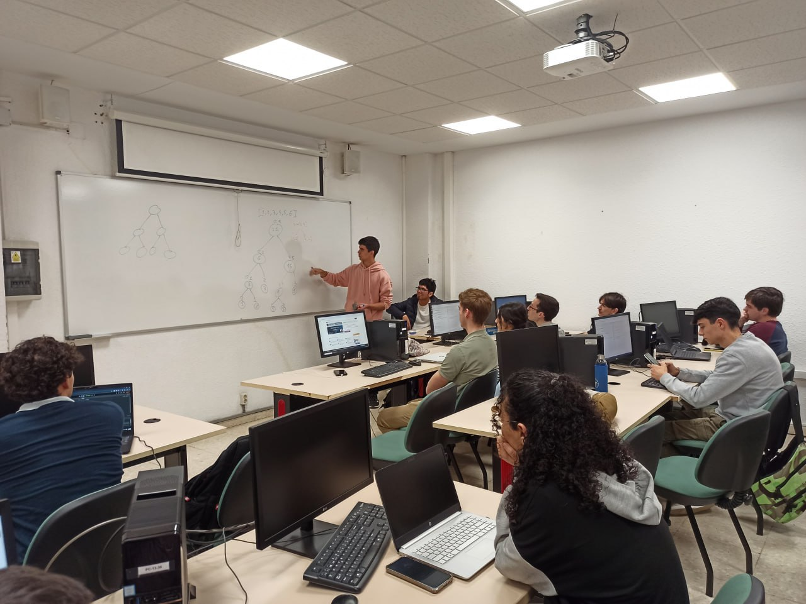
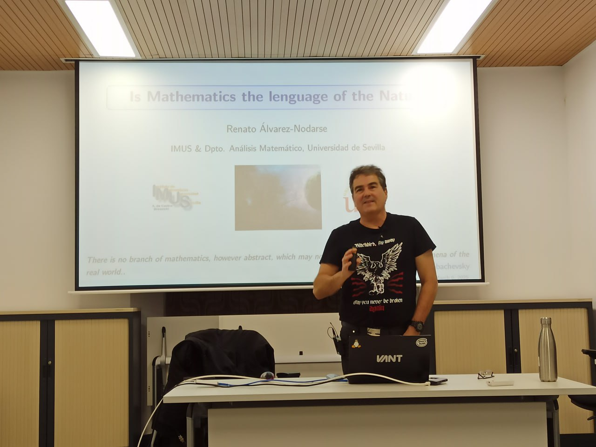
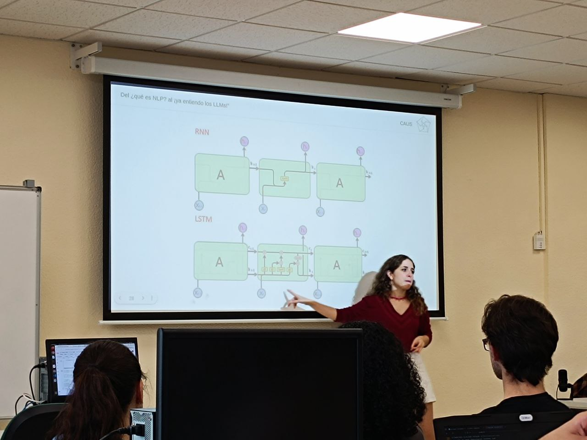
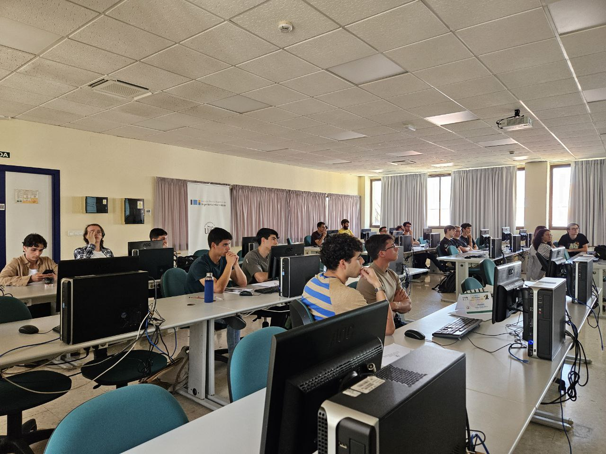
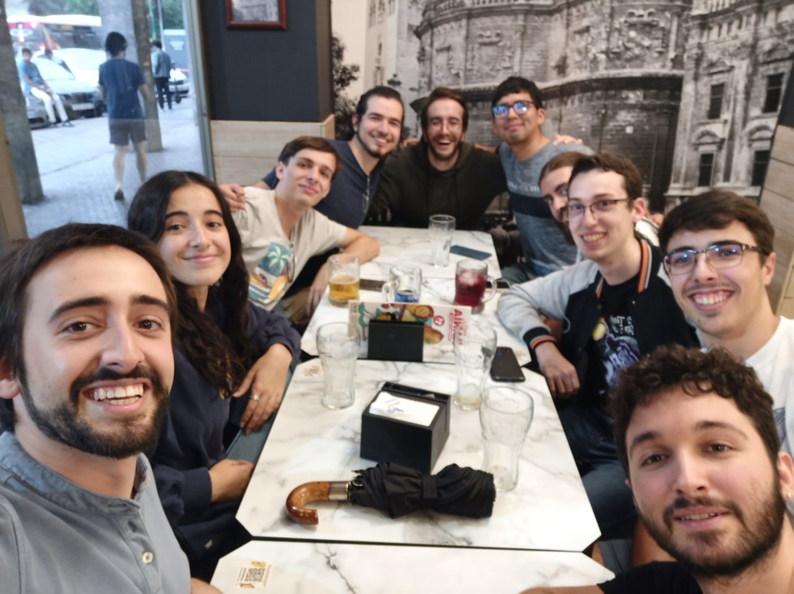

Bienvenidos al **Club de Algoritmia**, un grupo fundado por estudiantes de la Universidad de Sevilla con el objetivo de aprender y perfeccionar habilidades en programación a través de la colaboración y la participación en competiciones.

Originalmente creado para los estudiantes de la Escuela Técnica Superior de Ingeniería Informática y la Facultad de Matemáticas, nuestro club se ha expandido para incluir miembros de diversas facultades y escuelas.

En el Club de Algoritmia, creemos firmemente en el valor de enfrentar desafíos algorítmicos y problemas de programación. Este tipo de habilidades no solo son cruciales para las competiciones, sino que también son muy valoradas en las pruebas técnicas de muchas grandes empresas. Nuestro objetivo es ofrecer una plataforma donde los miembros puedan mejorar sus capacidades, compartir conocimientos y prepararse para el futuro profesional.

Únete a nosotros y forma parte de una comunidad apasionada por la programación, donde cada desafío es una oportunidad para aprender y crecer juntos.

---

# 📚 Actividades Académicas

## Sesiones de entrenamiento

Cada viernes organizamos sesiones de entrenamiento en las que practicamos la resolución de problemas en plataformas como LeetCode y HackerRank. Antes de empezar, nuestros administradores introducen las distintas estrategias, algoritmos o estructuras de datos que sean necesarios para enfrentar los problemas.

Todos participamos para aprender y apoyarnos unos a otros, así que no tengas miedo si crees que no sabes suficiente sobre programación!

<!-- 
 -->

  
  

## Charlas de Estudiantes y de la Industria

Organizamos sesiones cada viernes sobre temas relacionados con la programación competitiva. Este año, además, introducimos una nueva serie de charlas con ponentes de la academia, la industria y exalumnos, quienes abordarán una amplia gama de temas. La asistencia a las ponencias está abierta a todo el mundo, por lo que no es necesario ser miembro del CAUS ni estudiante de la US.

  - Comprueba las próximas charlas [en la sección de noticias](/news).
  - [Da tu propia ponencia!](https://forms.gle/yY9WpbA6Lof41ufa7) Si eres un profesional apasionado por la tecnología y con ganas de compartir tus conocimientos, estaremos encantados de contar contigo. Si eres un estudiante, esta es una gran oportunidad para profundizar en algún tema que te interese y hacer CV 😉

<!-- 
 -->

  
  

## Competiciones de Programación

Participamos en eventos anuales como [Advent of Code](https://adventofcode.com/) y el [Concurso Universitario de Programación Ada Byron](http://ada-byron.es/). Además, organizamos [nuestras propias competiciones de programación](news/2024-10-27-complicaus-2/) con suculentos premios, para mantenernos en constante práctica y aprendizaje.

<!-- 
 -->

  
  

---

# 🎉 Actividades Sociales

## Comida cuatrimestral

Cada cuatrimestre, organizamos una comida especial para celebrar nuestros logros y disfrutar en equipo. Esta es una excelente oportunidad para compartir una comida memorable y conocer a esas personas del grupo con las que aún no has coincidido.

<!--  -->

  

## Rocódromo

¿Qué mejor para entrenar esos dedos de programador que una buena sesión de escalada? De vez en cuando organizamos salidas extraoficiales al rocódromo para hacer un poco de ejercicio después de las sesiones de los viernes ¡Es una excelente oportunidad para desafiarse a uno mismo y fortalecer el espíritu de grupo!

<!--  -->

  

# Nuestro equipo

Conoce a las personas que hacen posible este proyecto, comprometidos con nuestra misión y valores.

