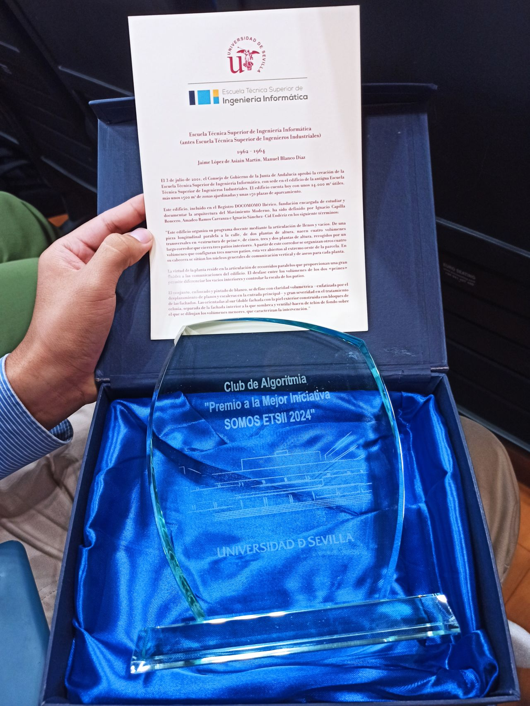

En nuestro primer año de actividad, hemos recibido diversos premios y reconocimientos que reflejan nuestro compromiso con la innovación y el trabajo en equipo. Estos logros, obtenidos en competiciones locales y nacionales, son un testimonio de nuestra dedicación y pasión por resolver problemas a través de la tecnología. A continuación, presentamos los premios y menciones que hemos alcanzado hasta la fecha.

# 2025

## Ganadores CompliCAUS IV

El 10 de Octubre de 2025 se celebró la cuarta edición del CompliCAUS IV, una competencia organizada por el Club de Algoritmia de la US. Al igual que en ediciones anteriores, el evento reunió a estudiantes de diversas instituciones, incluyendo a alumnos de bachillerato. Los siguientes participantes resultaron ganadores:



## II Edición Regional de Andalucía del Concurso Ada Byron

El viernes 25 de abril tuvo lugar la segunda edición regional del concurso Ada Byron, un certamen de programación cuyo objetivo es incentivar la participación en el prestigioso concurso internacional ICPC. En esta edición, celebrada simultáneamente en varias sedes de universidades andaluzas, tres equipos del Club de Algoritmia lograron clasificarse para la gran final del Ada Byron, que se celebrará en Madrid. Estos equipos fueron:

1. 🥇 **Just Simply FLML** – *Categoría A*

   * 1.º lugar en la sede de Sevilla y 3.º en el ranking global.
   * Integrantes: Jesús Racero, Jesús Vílchez, José Escalera.
   * 🎓 Grado en Ingeniería Informática (Software) – US.

2. 🥇 **IemaTecnico** – *Categoría C*

   * 4.º lugar en el ranking global.
   * Integrantes: Arnau Neches, Pablo Moreno, Carlos Fernández-Llebrez.
   * 🎓 Doble Grado en Matemáticas e Ingeniería Informática – US.

3. 🥇 **Massive** – *Categoría C*

   * 5.º lugar en el ranking global, destacando por ser novatos.
   * Integrantes: Jairo Serrano, José Luis Mesa, José Aguilera.
   * 🎓 Doble Grado en Matemáticas y Estadística, Doble Grado en Matemáticas y Física, Doble Grado en Física e Ingeniería de Materiales respectivamente – US.

## Ganadores CompliCAUS III

El 7 de febrero de 2025 se celebró la tercera edición del CompliCAUS III, una competencia organizada por el Club de Algoritmia de la US. Al igual que en ediciones anteriores, el evento reunió a estudiantes de diversas instituciones, incluyendo a alumnos de bachillerato.

La principal novedad de esta edición fue el patrocinio de la empresa NEXT DIGITAL, que hizo posible la entrega de premios a los equipos ganadores. A continuación, se presentan los participantes que obtuvieron los primeros lugares:



# 2024

## Premio "SOMOS ETSII" del curso 2023/2024

En reconocimiento al esfuerzo y la colaboración de todos los miembros, el Club recibió el premio "SOMOS ETSII" durante el curso académico 2023-24, otorgado por la Escuela Técnica Superior de Ingeniería Informática de la Universidad de Sevilla. Este galardón fue concedido "como reconocimiento a la generosidad y entrega hacia el beneficio común, aportando valor a la convivencia de nuestra comunidad, no solo desde la perspectiva académica." Un premio que refleja el trabajo colectivo y el compromiso de cada persona que ha formado parte de esta iniciativa.

  

## Ganadores CompliCAUS II

El 18 de octubre de 2024 se celebró la segunda edición de CompliCAUS II, una competencia de programación organizada por el Club de Algoritmia de la Universidad de Sevilla. Este evento reunió a estudiantes de diversas instituciones, incluyendo bachillerato y FP. Los siguientes participantes resultaron ganadores:



## I Edición Regional de Andalucía del Concurso Ada Byron

El 12 de abril de 2024 tuvo lugar la primera edición regional del concurso Ada Byron, un certamen de programación cuyo objetivo es incentivar la participación en el prestigioso concurso internacional ICPC. En esta edición, celebrada simultáneamente en varias sedes de universidades andaluzas, dos equipos del Club de Algoritmia lograron clasificarse para la gran final del Ada Byron, que se celebrará en Madrid. Estos equipos fueron:

### Equipo “La Cabeza de Turing”
Este equipo obtuvo el tercer lugar en la clasificación global del regional. ¡Enhorabuena!

- Julio Ojeda Infantes (Grado en Matemáticas)
- Pablo Puerto Muñoz (Grado en Matemáticas)
- Álvaro Luque Buzón (Grado en Ingeniería Informática – Ingeniería del Software)

### Equipo “lemaTécnico”
Este equipo consiguió el sexto lugar en la clasificación global del regional. ¡Felicidades!

- Carlos Fernández-Llebrez Acedo
- Pablo Moreno Moreu
- Arnau Neches Vilà

Todos ellos estudiantes del doble Grado en Ingeniería Informática – Tecnologías Informáticas y Matemáticas.

## Ganadores CompliCAUS I

El 23 de febrero de 2024 se celebró la primera edición de CompliCAUS, una competencia de algoritmia organizada por el Club de Algoritmia de la Universidad de Sevilla. Este evento también acogió a estudiantes de diversas instituciones, incluyendo bachillerato. Los siguientes participantes resultaron ganadores:


