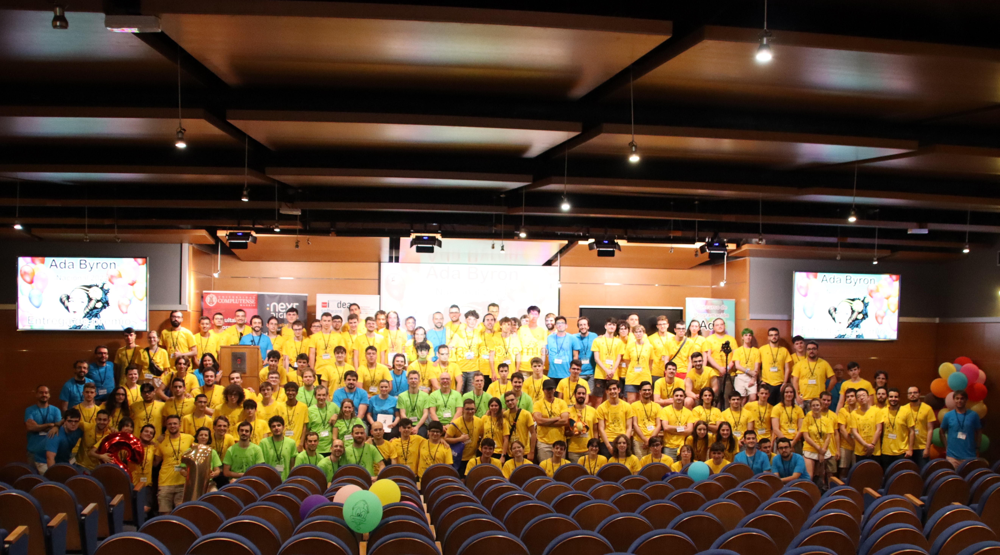

Los pasados días 5 y 6 de julio de 2024 se celebró la décima edición del concurso de programación Ada Byron  en la Facultad de Informática de la Universidad Complutense de Madrid en las que compitieron los mejores clasificados de cada región.

## Sedes participantes

El comité director del concurso tras analizar los datos la distribución de los equipos por región fue la siguiente:

* Regional de Andalucía: 8 equipos
* Regional de Galicia: 6 equipos
* Regional de Madrid: 10 equipos
* Regional Multisede: 9 equipos
* Regional de Murcia: 3 equipos
* Regional de Valencia: 6 equipos

Dos equipos pertenecientes al Club de Algoritmia lograron clasificarse a esta final nacional. Además de ellos, los administradores que fuimos como entrenadores de estos equipos, también participamos en una competencia alterna en la que resolvíamos los mismos problemas, pero competíamos con los otros entrenadores!

### Equipo **"La Cabeza de Turing"**

- **Julio Ojeda Infantes** (Grado en Matemáticas)
- **Pablo Puerto Muñoz** (Grado en Matemáticas)
- **Álvaro Luque Buzón** (Grado en Ingeniería Informática – Ingeniería del Software)

### Equipo **"lemaTécnico"**

- **Carlos Fernández - Llebrez Acedo**
- **Pablo Moreno Moreu**
- **Arnau Neches Vilà**

Todos ellos estudiantes del doble Grado en Ingeniería Informática – Tecnologías Informáticas y Matemáticas.
    

## Resultados y Agradecimientos

Durante las 4 horas de competición los equipos se enfrentaron a la resolución de 12 desafiantes problemas. A pesar de la alta exigencia, el equipo Pan de Pita (Categoría C) fue el ganador absoluto del concurso. !Enhorabuena a los ganadores!

Finalmente, desde el **CAUS** queremos expresar nuestro agradecimiento a la **Escuela Técnica Superior de Ingeniería Informática de Sevilla** por patrocinarnos el viaje a todo el equipo para ir a Madrid, a los organizadores del Ada Byron por hacer posible la organización de la final nacional, y también queremos agradecer a IMDEA Software, NEXT DIGITAL, Denodo y Bending Spoons por patrocinar el concurso.

Finalmente, desde el **CAUS**, queremos expresar nuestro agradecimiento a la **Escuela Técnica Superior de Ingeniería Informática de Sevilla** por cedernos la sede para los equipos de esta ciudad, así como a los organizadores de **Ada Byron Madrid** y **Galicia** por hacer posible esta primera edición andaluza.

