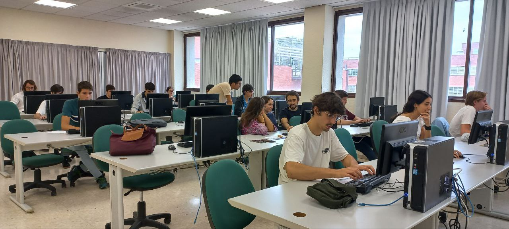
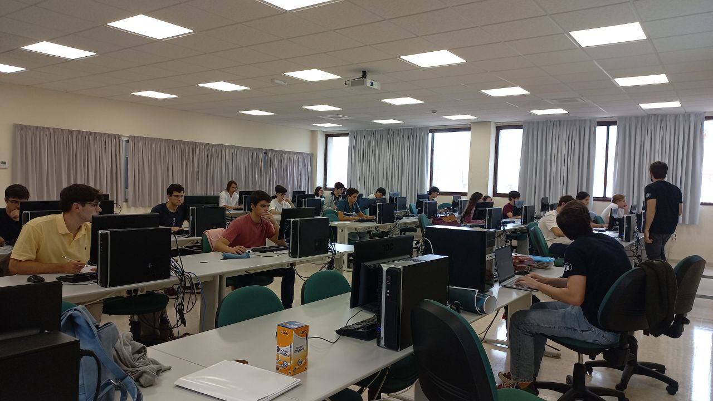
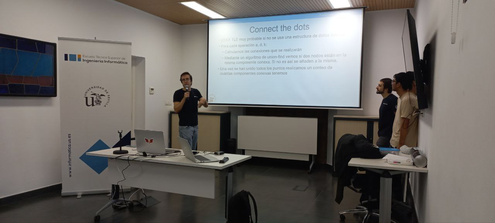

El viernes 18 de octubre se celebró la segunda edición de CompliCAUS, una competición de programación organizada por el Club de Algoritmia de la Universidad de Sevilla. Con el apoyo de la Escuela Técnica Superior de Ingeniería Informática (ETSII), el evento reunió a estudiantes de distintas facultades, niveles académicos y centros, incluyendo también bachillerato y formación profesional, para enfrentar un desafiante reto de algoritmia de dos horas.

La competición se llevó a cabo en el juez en línea [Virtual Judge](https://vjudge.net), que permite seleccionar problemas de múltiples jueces estándar y simula los envíos a cada uno de ellos, lo cual facilitó a los participantes enviar y evaluar automáticamente sus soluciones. Esta plataforma también brindó una experiencia más completa de entrada y salida de datos, similar a competiciones como Ada Byron, diferenciándose de otras como HackerRank, donde el foco es exclusivamente la resolución de algoritmos. Gracias a VJudge, los participantes pudieron practicar tanto la lógica de los algoritmos como el manejo de entrada y salida, una habilidad esencial en competiciones avanzadas.

El evento fue diseñado para que personas de cualquier nivel de experiencia pudieran participar y disfrutar del desafío. Por ello, se incluyeron problemas de diversas dificultades, haciendo que la estrategia de identificar y resolver los problemas más accesibles fuese clave para obtener buenos resultados.

Las diapositivas explicativas de los problemas del CompliCAUS II están disponibles en [Drive](https://drive.google.com/drive/folders/1HRhaTf-Dtha1T21ZTzjj7y-6WswkB9OP), y los interesados pueden encontrar los enunciados y soluciones en nuestro [repositorio de GitHub](https://github.com/algoritmiaUS/complicaus), ideal para quien quiera revivir los desafíos o intentar nuevamente los problemas.

# Participación

En esta edición participaron 27 estudiantes de instituciones como la Universidad de Sevilla (diversos grados de Ingeniería Informática, Matemáticas, Física, entre otros), la Universidad Politécnica de Cataluña, así como alumnos de bachillerato (Colegio Santa Ana, Colegio Esclavas Sevilla - Fundación Spínola) y de Formación Profesional (Grado Superior en Desarrollo de Aplicaciones Multiplataforma - IES El Majuelo).

# Resolución de problemas

Al terminar la competición, los responsables del CAUS, Pablo Dávila, Pablo Reina y Kenny Flores, guiaron una sesión en la sala Multiusos de la ETSII para explicar las estrategias de resolución de los problemas propuestos, brindando valiosos consejos y análisis.

<!-- *Este es el subtítulo de la imagen.* -->

# Entrega de premios 

La competición fue reñida desde el inicio, con cambios frecuentes en los primeros puestos durante la primera hora. Al final, estos fueron los ganadores:



# Agradecimientos 

Agradecemos a la Escuela Técnica Superior de Ingeniería Informática por su patrocinio y apoyo, así como a María Lourdes Miró (Subdirectora de Estudiantes, Innovación y Responsabilidad Social) y Juan Antonio Álvarez García (Subdirector de Investigación, Transferencia y Emprendimiento) quienes han sido clave para hacer de este evento una realidad.

<!-- Este ha sido solo el comienzo de lo que esperamos sea una larga tradición en la Universidad de Sevilla. Estamos seguros de que vendrán más competiciones como esta, donde los estudiantes podrán seguir desafiándose, aprendiendo y, por supuesto, divirtiéndose con la programación y la algoritmia. ¡Nos vemos en la próxima edición de CompliCAUS! -->

