El viernes 25 de abril se celebró en la ETSII la segunda edición dela **Regional de Andalucía** del concurso **Ada Byron**, un certamen de programación cuyo objetivo es fomentar la participación de estudiantes en el prestigioso concurso internacional **ICPC**. 

## Sedes y Universidades Participantes

Ada Byron Andalucía tuvo lugar simultáneamente en varias sedes de las universidades andaluzas:

- Escuela Superior de Ingeniería de la Universidad de Almería
- Escuela Superior de Ingeniería de la Universidad de Cádiz
- Escuela Técnica Superior Ingenierías Informática y de Telecomunicación de la Universidad de Granada
- Escuela Técnica Superior de Ingeniería Informática de la Universidad de Málaga
- Escuela Técnica Superior de Ingeniería Informática de la Universidad de Sevilla

En total más de 130 participantes repartidos en *46 equipos* participaron en esta edición. La distribución de los equipos fue la siguiente:

- Universidad de Almería: 1 equipos
- Universidad de Cádiz: 3 equipos
- Universidad de Granada: 11 equipos
- Universidad de Málaga: 19 equipos
- Universidad de Sevilla: 7 equipos
- Universidad Nacional de Educación a Distancia (UNED): 1 equipo

## Competición y resultados

Durante las 4 horas de competición, los equipos se enfrentaron a la resolución de 11 desafiantes problemas de programación. En la sede de Sevilla, los ganadores por categoría fueron:

---

### 🥇 Just Simply FLML – Categoría A

Este equipo obtuvo el **primer lugar** en la sede de Sevilla en la categoría A (primer curso). Aunque sufrieron con el problema A, hicieron sudar muchísimo al resto de participantes. ¡Enhorabuena!

- **Jesús Racero San Román** (Grado en Ingeniería Informática – Ingeniería del Software)
- **Jesús Vílchez Martínez** (Grado en Ingeniería Informática – Ingeniería del Software)
- **José Escalera García** (Grado en Ingeniería Informática – Ingeniería del Software)

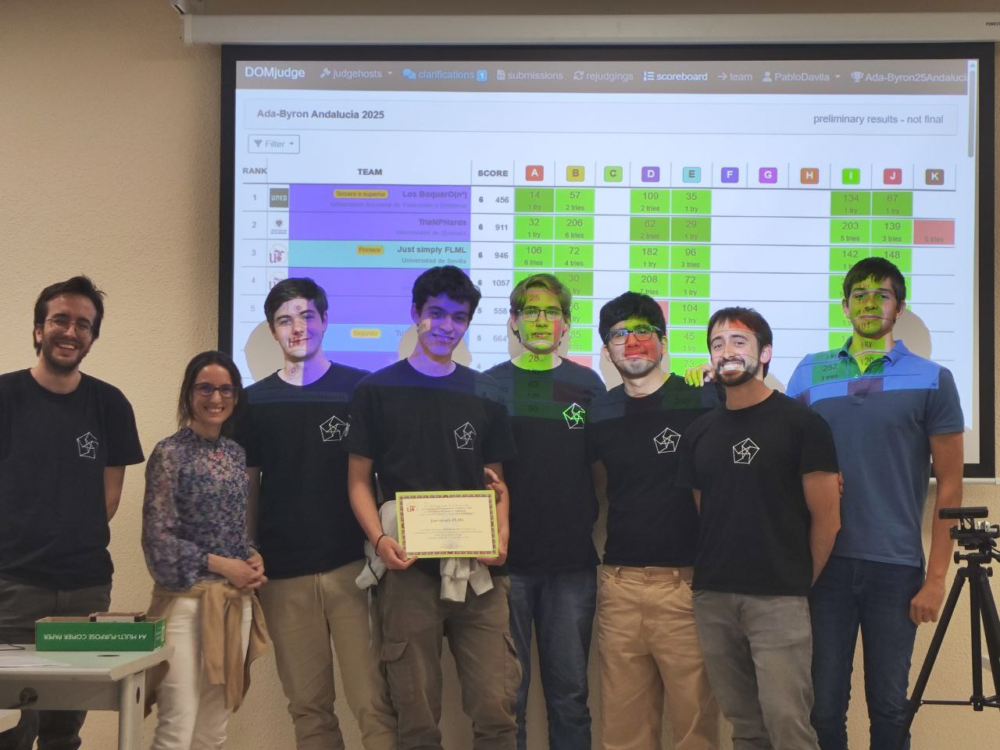

---

### 🥇 Los Mikel Bull – Categoría B

Ganadores de la **categoría B** (segundo curso), que en este equipo hubo un integrante en el que se pasó estudiando un solo tipo de problema (Tries) y entró. ¡Gran actuación!

- **Jesús Pérez Bazarot** (Grado en Ingeniería Informática – Ingeniería de Computadores)
- **Alejandro Pineda Martín** (Grado en Ingeniería Informática – Tecnologías Informáticas)
- **Henrique Rebollo Padovani** (Grado en Ingeniería Informática – Tecnologías Informáticas)

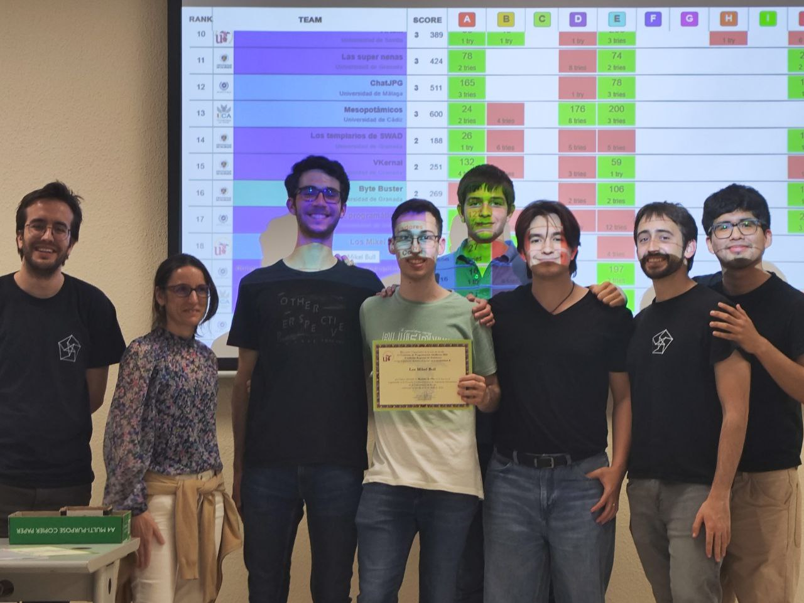

---

### 🥇 lemaTecnico – Categoría C

Este equipo ganó la **categoría C** (tercer curso o superior) en la sede de Sevilla, compitiendo con solamente 2 personas debido a que uno de los integrantes tenía que asistir a un evento muy importante.¡Excelente trabajo!

- **Arnau Neches Vilà** (Doble Grado en Matemáticas e Ingeniería Informática)
- **Pablo Moreno Moreu** (Doble Grado en Matemáticas e Ingeniería Informática)
- **Carlos Fernández-Llebrez Acedo** (Doble Grado en Matemáticas e Ingeniería Informática)

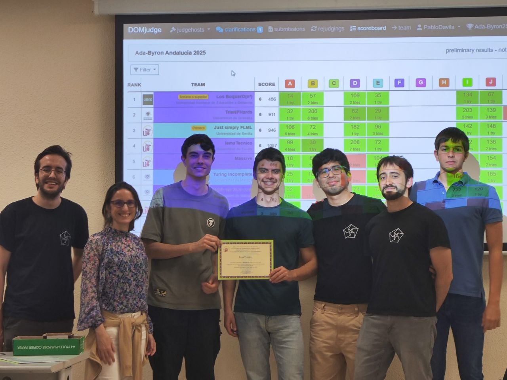 

---

## Clasificados a la final nacional

Siete equipos de la fase regional de Andalucía han logrado clasificarse para la **final nacional del Concurso Ada Byron**, que se celebrará a principios de julio en la Facultad de Informática de la Universidad Complutense de Madrid:

- **Just Simply FLML** (US) – Categoría AB  
- **Turing Incomplete** (UMA) – Categoría AB  
- **ChatJPG** (UMA) – Categoría AB  
- **TrieNPHards** (UGR) – Categoría C  
- **IemaTecnico** (US) – Categoría C  
- **Massive** (US) – Categoría C
- **Los BoquerO(n³)** (UNED) - Categoría C entre las universidades a distancia

---

## Equipos clasificados de la sede de la Universidad de Sevilla

De los 7 equipos clasificados para esta competición, 3 pertenecen a la Universidad de Sevilla. Y si contamos que el equipo de la UNED también participó en nuestra sede, podemos decir que 4 equipos han salido de la sede de la US, lo que supone un logro histórico en comparación con el año pasado. Los equipos clasificados para el nacional provenientes de nuestra sede son:

### 🥇 Just Simply FLML – Categoría A

Este equipo obtuvo el **primer lugar** en la sede de Sevilla en la categoría A, además de haber quedado en tercer lugar del ranking global, por lo que tienen su merecida clasificación a la final nacional. ¡Enhorabuena!

- **Jesús Racero San Román** (Grado en Ingeniería Informática – Ingeniería del Software)
- **Jesús Vílchez Martínez** (Grado en Ingeniería Informática – Ingeniería del Software)
- **José Escalera García** (Grado en Ingeniería Informática – Ingeniería del Software)

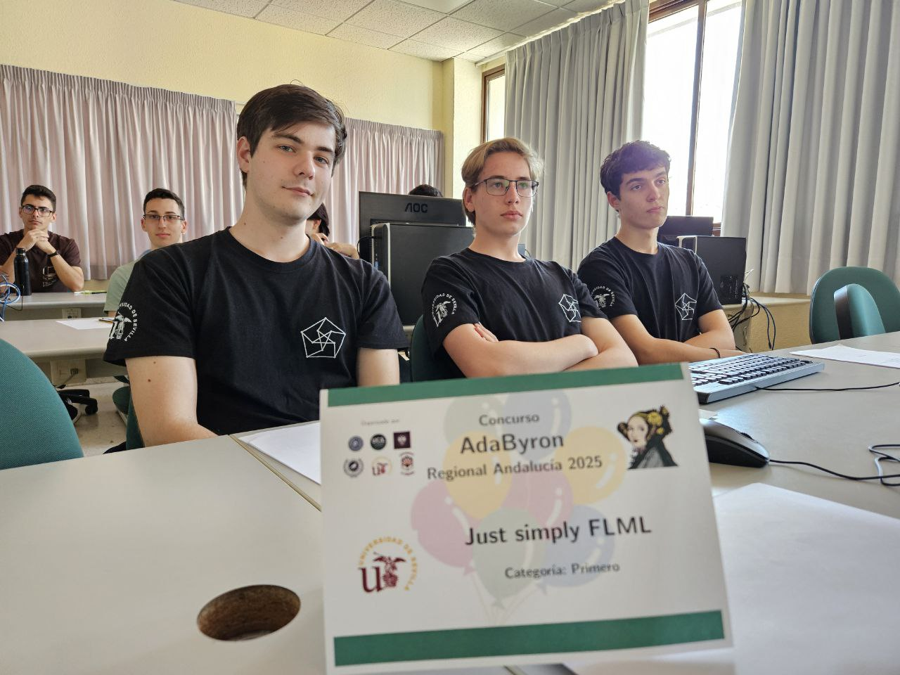

**Equipo Just Simply FLML durante la competición.**

---

### 🥇 IemaTecnico – Categoría C

A pesar de ser dos integrantes los que participaron, quedaron en un cuarto lugar en el ranking global, por lo que este equipo también representará a la US en su categoría más avanzada ¡Excelente trabajo!

- **Arnau Neches Vilà** (Doble Grado en Matemáticas e Ingeniería Informática)
- **Pablo Moreno Moreu** (Doble Grado en Matemáticas e Ingeniería Informática)
- **Carlos Fernández-Llebrez Acedo** (Doble Grado en Matemáticas e Ingeniería Informática)

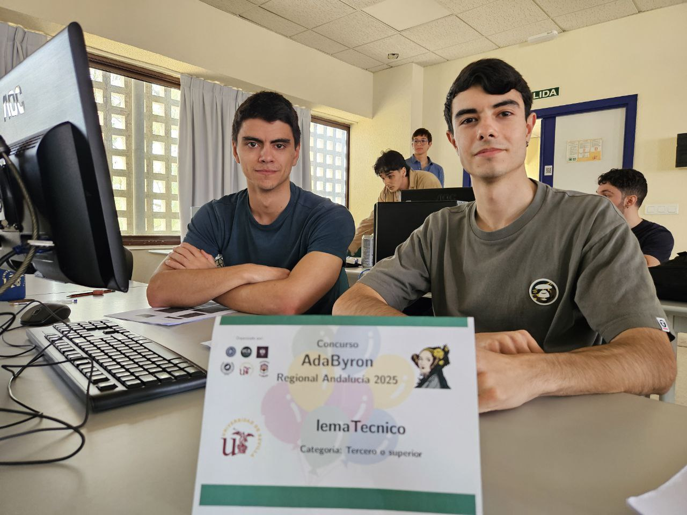 

**El equipo IemaTecnico (Los favoritos de Renato)**

---

### 🥇 Massive – Categoría C

Este equipo, habiendo quedado en un increíble quinto lugar en el ranking general, y teniendo aún más mérito llevando tan poco tiempo en el mundillo de la programación competitiva. Además en el que uno de sus integrantes, ha participado en la máxima categoría ¡Siendo de primero de carrera! Así que muchas felicidades

- **Jairo Serrano Picón** (Doble Grado en Matemáticas y Estadística)
- **José Luis Mesa Solano** (Doble Grado en Matemáticas y Física)
- **José Aguilera Rodríguez** (Doble Grado en Física e Ingeniería de Materiales)

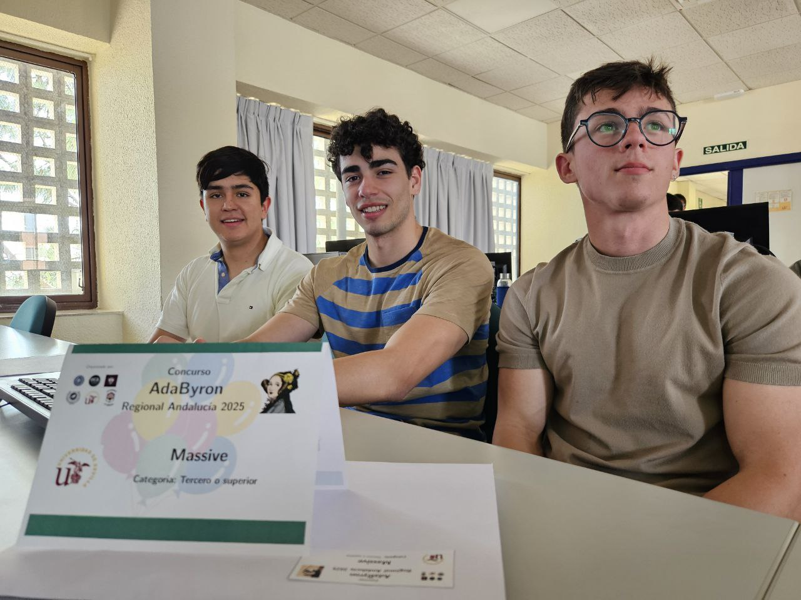 

**El equipo Massive, uno de los representantes de la US en la categoría superior.**

---

### 🥇 Los BoquerO(n³)** (UNED) – Categoría C

Aunque no pertenecen a nuestra universidad, participaron en la sede de Sevilla y dejaron huella por su cercanía, compañerismo y nivel competitivo. Han quedado primeros del ranking general durante dos años consecutivos, lo cual es digno de admiración. ¡Enhorabuena!

- **Ignacio de Gorostidi Colás**(Grado en Ingeniería Informática)
- **Adrián Peinado Santiago**(Grado en Ingeniería Informática)
- **Juan Torres Gómez**(Grado en Ingeniería Informática)

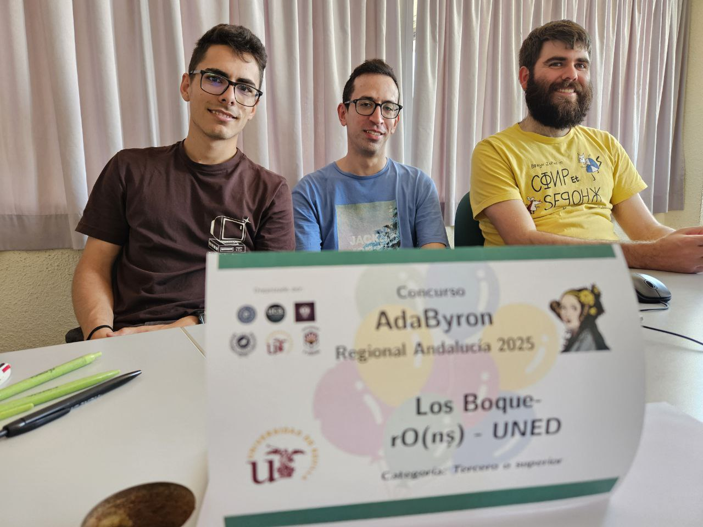 

**Los BoquerO(n³) Los únicos en la sede de sevilla que programaron con Java**

### Otros equipos pertenecientes al CAUS

Además de los clasificados, queremos agradecer a los equipos **TLE Climbers**, **Virtem**, **Los Mikel Bull** y **git gud** por haber participado en este certamen. La verdad es que en general, el rendimiento de los equipos ha sido muy buena. 	

  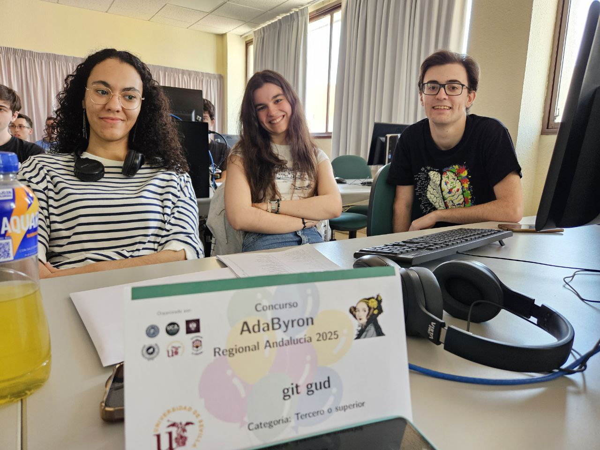
  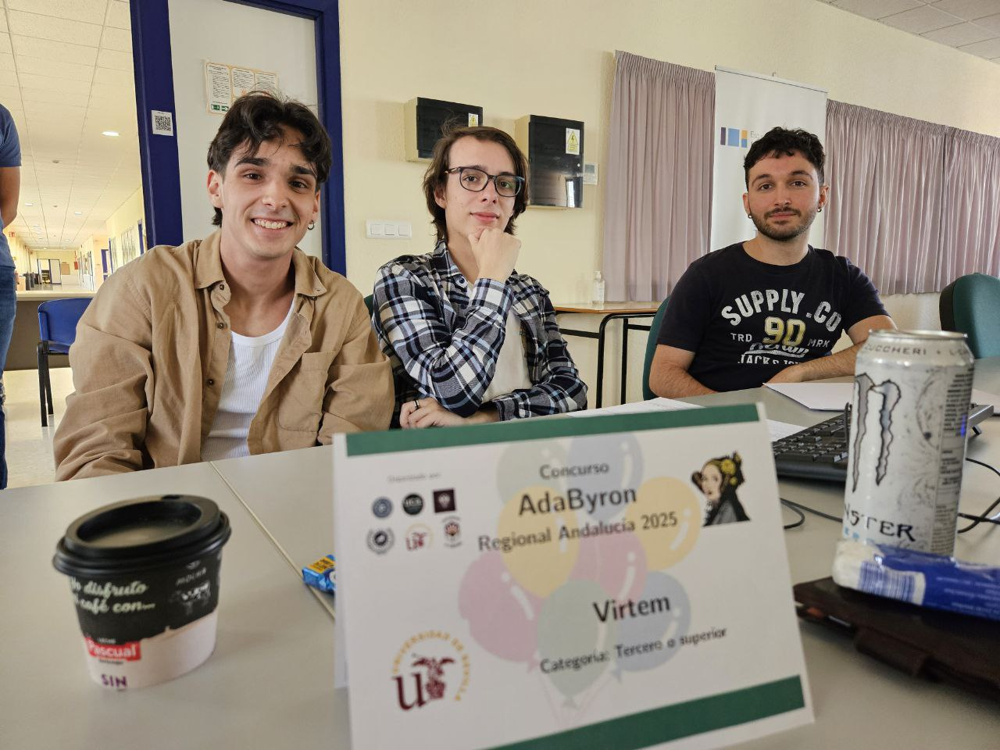
  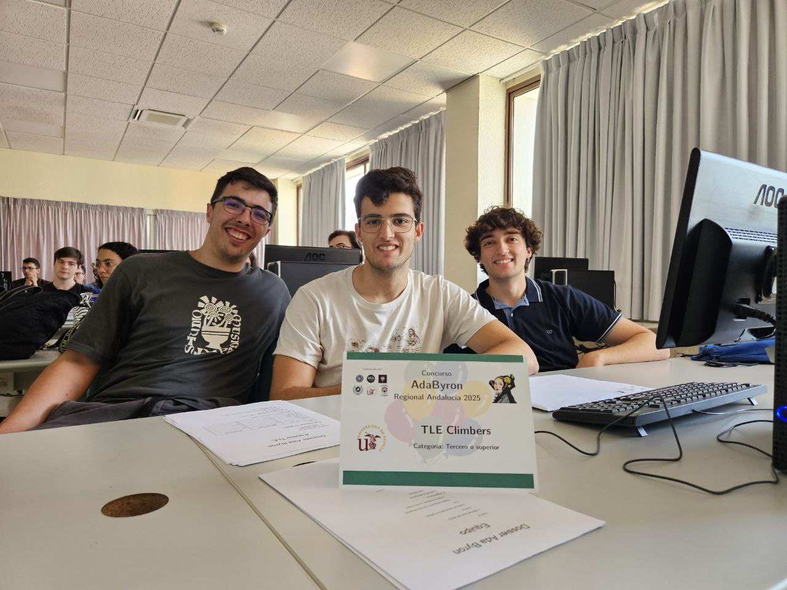
  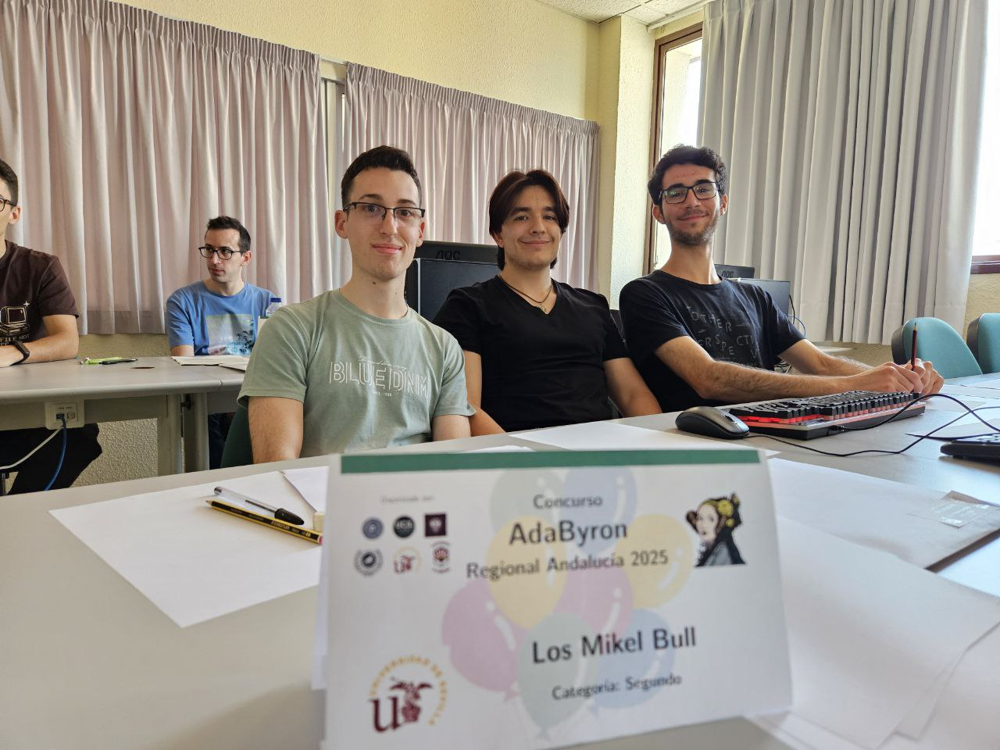

## Jueces y agradecimientos

Durante la competición, la resolución de dudas y la verificación de resultados proporcionados por el juez automático estuvieron a cargo de miembros del **Club de Algoritmia**, a quienes agradecemos profundamente por su dedicación y compromiso. Ellos son:

* **Pablo Dávila Herrero**
* **Pablo Reina Jiménez**
* **Kenny Jesús Flores Huamán**

Las soluciones a los problemas propuestos están disponibles en nuestro [repositorio de GitHub](https://github.com/algoritmiaUS/ada-byron), junto con una [guía detallada para abordarlos](Soluciones-Regional-Andalucia-ii.pdf).

Desde la organización, también vivimos nuestro propio reto: además de supervisar cientos de envíos en C, C++, Java y Python, fue necesario resolver algunas incidencias en tiempo real, lo cual supuso un esfuerzo importante y enriquecedor.

Como fundadores del Club de Algoritmia de la Universidad de Sevilla, no podemos sino sentirnos orgullosos del crecimiento de nuestros equipos. En tan solo unas pocas ediciones hemos sido testigos de cómo han evolucionado tanto en número como en nivel, fruto de las sesiones de preparación y del entusiasmo compartido 💪🏻.

Queremos hacer una mención especial de agradecimiento a:

* Nuestro voluntario Fernando Giráldez Curquejo, por todo el apoyo que nos dió.
* Mª Lourdes Miró Amarante y Juan Antonio Álvarez, por su impecable labor organizativa en Sevilla, coordinando las sedes y preparando toda la infraestructura técnica.
* Todo el profesorado de las universidades andaluzas que colaboró aportando problemas o actuando como coordinadores locales.
* Y, como siempre, a Marco Antonio y Alberto Verdejo de la Universidad Complutense de Madrid, cuyo apoyo continuo hace posible que esta iniciativa siga creciendo.

¡Gracias por ser parte de esta aventura y por seguir promoviendo el talento y la pasión por la algoritmia!
