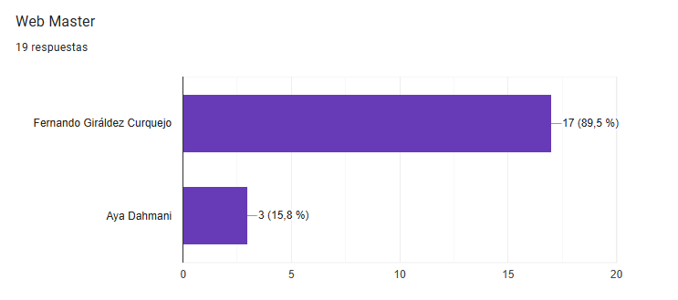
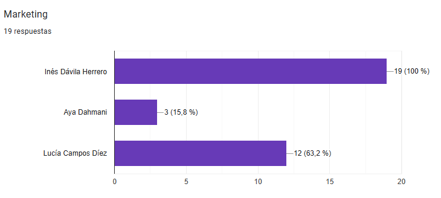
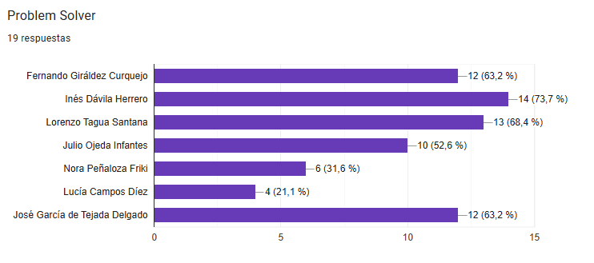
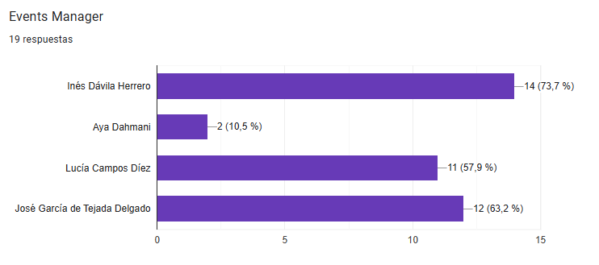
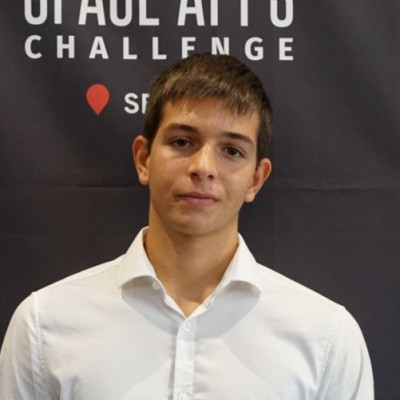
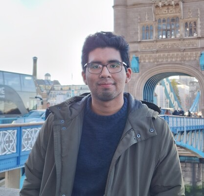
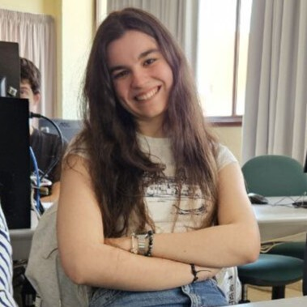
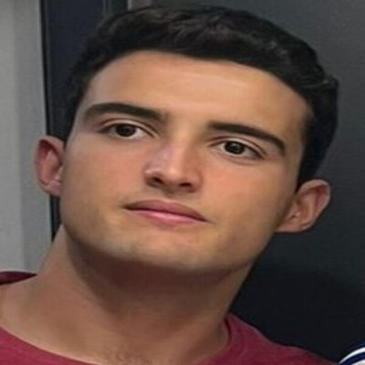
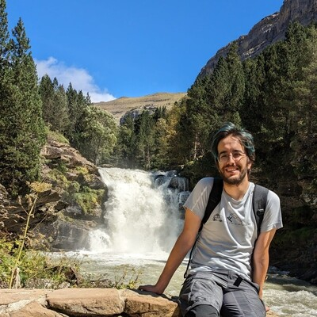

En las elecciones del Club de Algoritmia de la Universidad de Sevilla (CAUS) para el curso **2025-2026**, participaron **19 miembros**. ¡Gracias a todos por su implicación! 🎉

---

## 🗳️ Resultados por categoría

A continuación presentamos los resultados oficiales por cada área del club. ¡Enhorabuena a todos los seleccionados!

### 👨‍💻 Web Masters

En esta categoría se elegía a una persona para apoyar en el desarrollo de la web del club junto a Kenny. La persona seleccionada ha sido:

- **Fernando Giráldez Curquejo**

Fernando ha estado vinculado al club desde bachillerato y comienza su primer año de carrera como Web Master. ¡Empieza fuerte!

---

### 📢 Marketing

Había dos plazas disponibles para encargarse de la imagen del club en redes sociales. Las más votadas fueron:

- **Inés Dávila Herrero**
- **Lucía Campos Díez**

Ambas aportarán frescura y creatividad al equipo de comunicación.

### 🧠 Problem Solvers

La categoría más reñida. Inicialmente se ofrecían 3 plazas, pero debido a un empate técnico, se han concedido 4. Los nuevos integrantes son:

- **Inés Dávila Herrero**,
- **Lorenzo Tagua Santana**,
- **Fernando Giráldez Curquejo**
- **José García de Tejada Delgado**

Un equipo con muchísimo potencial para que, tanto nuevos como veteranos, sigamos creciendo juntos en las competiciones. ¡Que el podio del regional Ada Byron del próximo año hable solo de la US! 😄

---

### 🎪 Events Managers

Pablo Dávila continuará apoyando de forma puntual en la organización de eventos, pero cede el protagonismo a los nuevos responsables:

- **José García de Tejada Delgado**
- **Lucía Campos Díez** *(nuevos)*

¡Mucha ilusión y ganas de hacer grandes cosas este año!

---

### 👋 Despedida a quienes se retiran

- **Lourdes Linares Barrera**
- **Paula Gómez**

💙 Desde el club, queremos agradeceros profundamente vuestra dedicación, compromiso y el cariño con el que habéis trabajado. ¡Hasta siempre!

## 🧑‍🏫 Administradores 2025-2026

Por lo que, los nuevos administradores para este nuevo curso 2025/26 son:

---

  <!-- Fernando -->
  

    
    
Fernando Giráldez

    

      Web Master y Problem Solver   ???
    

  

  <!-- Kenny -->
  

    
    
Kenny Flores

    

      Web Master y Problem Solver   Doctorado en Organización Industrial
    

  

  <!-- Inés -->
  

    
    
Inés Dávila

    

      Marketing & Problem Solver
        ???
    

  

  <!-- Lucía -->
  

    
    
Lucía Campos

    

      Marketing y Event Manager   Ingeniería de Software
    

  

  <!-- José -->
  

    
    
José García

    

      Problem Solver y Event Manager   Máster IA
    

  

  <!-- Lorenzo -->
  

    
    
Lorenzo Tagua

    

      Problem Solver   ???
    
 
  

  <!-- Pablo Dávila -->
  

    
    
Pablo Dávila

    

      Support Events   ???
    

  

  <!-- Pablo Reina -->
  

    
    
Pablo Reina

    

      Problem Solver   Doctorado en Ingeniería Informática
    

  

## 🎉 **¡Enhorabuena a todos los nuevos administradores!**  
Gracias por vuestra energía, motivación y por seguir haciendo de CAUS un proyecto colaborativo y apasionante.  
¡Nos espera un gran año por delante! 🚀