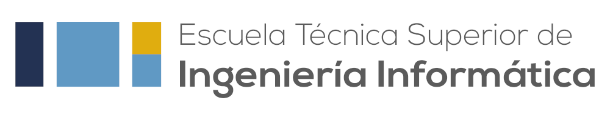

  Patrocinador principal: <a href="https://www.informatica.us.es/">Escuela Técnica Superior de Ingeniería Informática</a>

¡La primera competición interna de la temporada 2025-26 ya está aquí! 🎉

El **CompliCAUS** es nuestra propia competición de programación, abierta a todo aquel que quiera participar. Esta cuarta edición se celebrará el próximo **10 de octubre** en la ETSII.

### ¿Qué te espera en esta edición?

- **Problemas para todos los niveles:** Hemos diseñado retos que van desde lo más accesible, para principiantes, hasta desafíos que pondrán a prueba a los más experimentados.
- **Estrategia y gestión del tiempo:** La clave estará en identificar los problemas más fáciles y maximizar tus puntos. ¡La diversión está garantizada!
- **250€ en premios:** Recompensas en efectivo para los mejores competidores. Próximamente anunciaremos los detalles sobre la distribución.
- **Ambiente inclusivo y competitivo:** Una oportunidad perfecta para aprender, mejorar tus habilidades y compartir con la comunidad.

✨ **Detalles e inscripción**  
¡No te pierdas este evento único! Inscríbete a través del [formulario](https://forms.gle/VbiiaGueriNRNvte6) y asegura tu lugar.

📍 **ETSII, Universidad de Sevilla**  
📅 **10 de octubre de 2025**

🚀 **Demuestra tus habilidades y disfruta del reto en el CompliCAUS IV!**

  
Patrocinado por:

  

    
    
Patrocinador Platino

  

