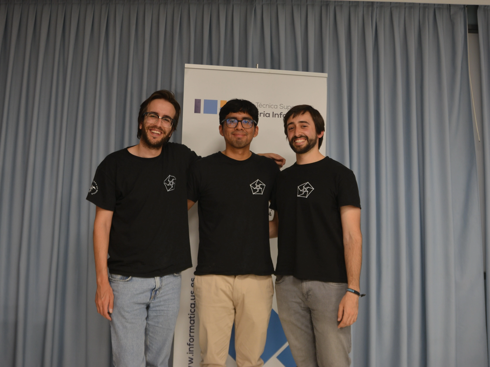

El pasado viernes 17 de abril, en la Escuela Técnica Superior de Ingeniería Informática (ETSII) se celebró la III Edición Regional de Andalucía del Concurso Ada Byron. Este certamen no solo premia la destreza lógica, sino que sirve como plataforma de preparación para el prestigioso concurso internacional ICPC.

## Sedes y universidades participantes

La competición se desarrolló de forma simultánea en seis sedes clave de la geografía andaluza, fomentando la descentralización y la participación masiva:

| Universidad                                          | Nº de equipos |
| ---------------------------------------------------- | ------------: |
| Universidad de Málaga                                | 26            |
| Universidad de Sevilla                               | 20            |
| Universidad de Granada                               | 8             |
| Universidad de Cádiz                                 | 6             |
| Universidad de Córdoba                               | 5             |
| Universidad de Almería                               | 2             |

Además de los estudiantes de las sedes, participaron concursantes de la Universidad Nacional de Educación a Distancia (UNED) y la Universidad Europea en Andalucía (UEA). En total, el evento contó con 204 participantes integrados en 69 equipos. La distribución por centros refleja el creciente interés por la algoritmia en nuestra comunidad.

## Equipos premiados en la sede de sevilla

Durante 4 horas de máxima concentración, los equipos se enfrentaron a un panel de 13 problemas de diversa complejidad. En la sede de Sevilla, los resultados fueron excepcionales.

### 🥇 tle climbers (campeones regionales)

Este equipo no solo dominó la Categoría C, sino que se alzó con el primer puesto de la clasificación general de Andalucía ¡Enhorabuena!

- **Lorenzo Tagua Santana** (Grado en Ingeniería de Tecnologías Industriales)
- **Julio Ojeda Infantes** (Grado en Matemáticas)
- **Mario Mora Cortés** (Grado en Matemáticas)

### 🥇 just simply flml

Este equipo, que el año pasado competía en la Categoría A, se ha proclamado este año campeón de la Categoría B.

- **Jesús Racero San Román** (Grado en Ingeniería Informática – Ingeniería del Software)
- **Jesús Vílchez Martínez** (Grado en Ingeniería Informática – Ingeniería del Software)
- **José Escalera García** (Grado en Ingeniería Informática – Ingeniería del Software)

### 🥇 sqlito

La gran sorpresa de la edición. Siendo estudiantes de primer año, lograron el cuarto lugar regional y el liderazgo de la Categoría A. Un debut brillante que puso en jaque a los equipos más veteranos.

- **Inés Dávila Herrero** (Grado en Ingeniería Informática - Inteligencia Artificial)
- **Fernando Giráldez Curquejo** (Grado en Ingeniería Informática - Ingeniería de Computadores)
- **Lucas Franco Borrero** (Grado en Matemáticas)

### menciones especiales

**TLEtubbies:** ganadores del premio al "Primer Envío Correcto" del concurso. Un reconocimiento a su agilidad inicial.

- Sebastián Romero Moreno (Grado en Ingeniería Informática - Tecnologías Informáticas)
- Carlos Gamito Moreno (Grado en Ingeniería Informática - Tecnologías Informáticas)
- Jesús Núñez Pelayo (Grado en Ingeniería Informática - Tecnologías Informáticas)

**HaskellRunners:** premiados por la "Última Entrega Correcta", resolviendo un problema in extremis justo antes del cierre del juez. Un homenaje perfecto a la perseverancia (y a David Solís).

- **Salvador de la Torre González** (Doble Grado Ingeniería Informática y Matemáticas)
- **Ángela Martínez Carrasco** (Doble Grado Ingeniería Informática y Matemáticas)
- **Antonio María Halcón Álvarez** (Doble Grado Ingeniería Informática y Matemáticas)

## Clasificados a la final nacional

Tras los resultados provisionales, y a falta de confirmación oficial, los siguientes equipos han asegurado su plaza para la Final Nacional del concurso Ada Byron, que se celebrará en julio en la Universidad Complutense de Madrid:

- **SQLito** (US) – Categoría A
- **Just Simply FLML** (US) – Categoría B
- **TLE Climbers** (US) – Categoría C

En función de la valoración por parte de la organización nacional es posible que se unan a la final otros equipos que han participado en este regional.

## Jueces y supervisión técnica

Detrás de cada línea de código enviada, hubo un equipo humano velando por la transparencia y el correcto funcionamiento del certamen. La resolución de dudas y la supervisión del juez automático recayó en los fundadores del Club de Algoritmia, cuya dedicación fue impecable:

- **Pablo Dávila Herrero**
- **Pablo Reina Jiménez**
- **Kenny Jesús Flores Huamán**

Como fundadores del CAUS, nos llena de orgullo ver la evolución técnica y el crecimiento de la comunidad en Sevilla. Supervisar cientos de envíos en C, C++, Java y Python, mientras gestionamos incidencias en tiempo real, ha sido un reto tan exigente como gratificante.

## Soluciones y recursos

Para aquellos que quieran revisar los problemas, aprender nuevas estrategias o practicar para próximas ediciones, hemos publicado los enunciados, soluciones y explicación de las soluciones en nuestro [repositorio de GitHub](https://github.com/algoritmiaUS/ada-byron/tree/master/2026/regional-andaluza).

## Equipo de voluntarios

Nada de esto habría sido posible sin el apoyo de los voluntarios que dedicaron su tiempo a que el evento fluyera sin problemas. Queremos agradecer especialmente a:

- Araceli Guerrero Morato
- Julia Moreno Mejías
- Lucía Campos Díez
- Iana Miranda Caramé
- Aitor Rodríguez Dueñas
- José García De Tejada Delgado

  
  

## Agradecimientos especiales

- A Elena Cerezuela Escudero, por una coordinación logística impecable en la sede de Sevilla.
- Al profesorado de las universidades andaluzas que colaboró en la creación de problemas y la supervisión local.
- A Marco Antonio, Pedro Pablo y a Alberto Verdejo (UCM), cuyo apoyo es el pilar que permite que AdaByron siga creciendo cada año.

¡Gracias a todos por vuestro talento y pasión! Nos vemos en la final nacional.
