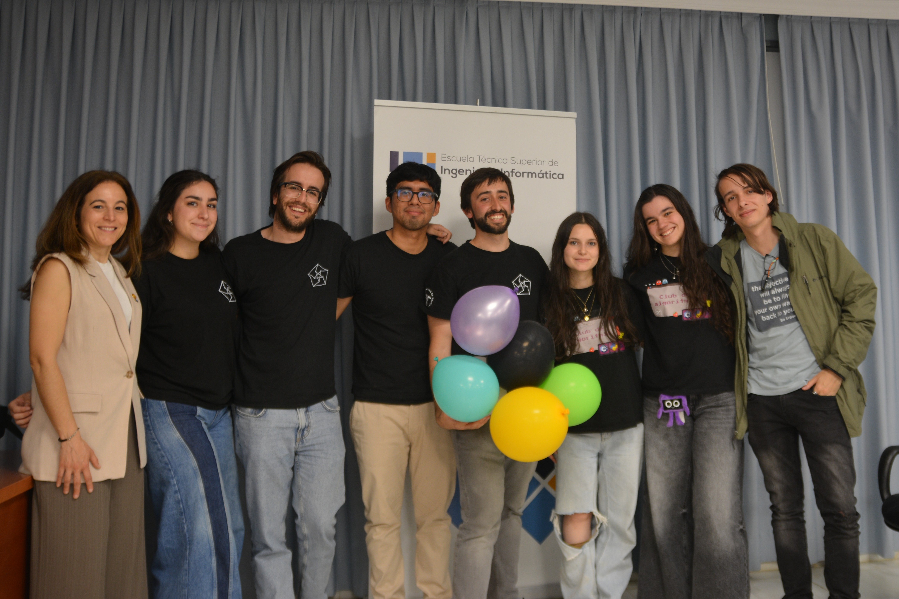

El viernes 17 de abril se celebró en la ETSII la tercera edición de la **Regional de Andalucía** del concurso **Ada Byron**, un certamen de programación cuyo objetivo es fomentar la participación de estudiantes en el prestigioso concurso internacional **ICPC**.

## Sedes y Universidades Participantes

Ada Byron Andalucía tuvo lugar simultáneamente en varias sedes de las universidades andaluzas:

- Escuela Superior de Ingeniería de la Universidad de Almería
- Escuela Superior de Ingeniería de la Universidad de Cádiz
- Escuela Politécnica Superior de Córdoba de la Universidad de Córdoba
- Escuela Técnica Superior Ingenierías Informática y de Telecomunicación de la Universidad de Granada
- Escuela Técnica Superior de Ingeniería Informática de la Universidad de Málaga
- Escuela Técnica Superior de Ingeniería Informática de la Universidad de Sevilla

En total más de 200 participantes repartidos en *69 equipos* participaron en esta edición. La distribución de los equipos fue la siguiente:

- Universidad de Almería: 2 equipos
- Universidad de Cádiz: 6 equipos
- Universidad de Córdoba: 5 equipos
- Universidad de Granada: 8 equipos
- Universidad de Málaga: 26 equipos
- Universidad de Sevilla: 20 equipos
- Universidad Nacional de Educación a Distancia (UNED): 1 equipo
- Universidad Europea Andalucía(UEA): 1 equipo

## Competición y resultados

Durante las 4 horas de competición, los equipos se enfrentaron a la resolución de 13 desafiantes problemas de programación. En la sede de Sevilla, los ganadores por categoría fueron:

---

### TLEtubbies

Sebastián Romero Moreno, Carlos Gamito Moreno, Jesús Núñez Pelayo
Premio secundario 1.

### HaskellRunners

Salvador de la Torre Gonzalez, Ángela Martínez Carrasco, Antonio Maria Halcon Alvarez
Premio secundario 2.

### 🥇 SQLito – Categoría A

# Kenny

Este equipo obtuvo el **primer lugar** en la sede de Sevilla en la categoría A (primer curso). Aunque sufrieron con el problema M, hicieron sudar muchísimo al resto de participantes. ¡Enhorabuena!

- **Inés Dávila Herrero** (Grado en Ingeniería Informática-Inteligencia Artificial)
- **Lucas Franco Borrero** (Grado en Matemáticas)
- **Fernando Giráldez Curquejo** ( Grado en Ingeniería Informática-Ingeniería de Computadores)

---

### 🥇 Just Simply FLML – Categoría B

# Kenny

Ganadores de la **categoría B** (segundo curso), que en este equipo hubo un integrante en el que se pasó estudiando un solo tipo de problema (Tries) y entró. ¡Gran actuación!

- **Jesús Racero San Román** (Grado en Ingeniería Informática – Ingeniería del Software)
- **Jesús Vílchez Martínez** (Grado en Ingeniería Informática – Ingeniería del Software)
- **José Escalera García** (Grado en Ingeniería Informática – Ingeniería del Software)

---

### 🥇 TLE Climbers – Categoría C

# Kenny

Este equipo ganó la **categoría C** (tercer curso o superior),

- **Julio Ojeda Infantes** (Grado en Matemáticas)
- **Lorenzo Tagua Santana** (Grado en Ingeniería de Tecnologías Industriales)
- **Mario Mora Cortés** (Grado en Matemáticas)

---

## Clasificados a la final nacional

# Kenny, no se si hay mas equipos

Cuatro equipos de la fase Regional de Andalucía han logrado clasificarse para la **final nacional del Concurso Ada Byron**, que se celebrará a principios de julio en la Facultad de Informática de la Universidad Complutense de Madrid:

- **SQLito** (US) – Categoría AB
- **Just Simply FLML** (US) – Categoría AB
- **TLE Climbers** (US) – Categoría C
- **Los BoquerO(n³)** (UNED) - Categoría C entre las universidades a distancia

---

## Equipos clasificados de la sede de la Universidad de Sevilla

De los 4 equipos clasificados para esta competición, 3 pertenecen a la Universidad de Sevilla. Y si contamos que el equipo de la UNED también participó en nuestra sede, podemos decir que 4 equipos han salido de la sede de la US, lo que supone un logro histórico en comparación con el año pasado. Los equipos clasificados para el nacional provenientes de nuestra sede son:

### 🥇 SQLito – Categoría A

Este equipo obtuvo el **primer lugar** en la sede de Sevilla en la categoría A, además de haber quedado en cuarto lugar del ranking global, por lo que tienen su merecida clasificación a la final nacional. ¡Enhorabuena!

- **Inés Dávila Herrero** (Grado en Ingeniería Informática-Inteligencia Artificial)
- **Lucas Franco Borrero** (Grado en Matemáticas)
- **Fernando Giráldez Curquejo** (Grado en Ingeniería Informática-Ingeniería de Computadores)

**El equipo SQLito durante la competición.**

---

### 🥇 Just Simply FLML – Categoría B

# Kenny

A pesar de ser dos integrantes los que participaron, quedaron en un decimo lugar en el ranking global, por lo que este equipo también representará a la US en su categoría más avanzada ¡Excelente trabajo!

- **Jesús Racero San Román** (Grado en Ingeniería Informática – Ingeniería del Software)
- **Jesús Vílchez Martínez** (Grado en Ingeniería Informática – Ingeniería del Software)
- **José Escalera García** (Grado en Ingeniería Informática – Ingeniería del Software)

**El equipo Just Simply FLML durante la competición.**

---

### 🥇 TLE Climbers – Categoría C

# Kenny

Este equipo, habiendo quedado en un increíble primer lugar en el ranking general, y teniendo aún más mérito llevando tan poco tiempo en el mundillo de la programación competitiva. Así que muchas felicidades

- **Julio Ojeda Infantes** (Grado en Matemáticas)
- **Lorenzo Tagua Santana** (Grado en Ingeniería de Tecnologías Industriales)
- **Mario Mora Cortés** (Grado en Matemáticas)

**El equipo TLE Climbers, uno de los representantes de la US en la categoría superior.**

---

### 🥇 Los BoquerO(n³)** (UNED) – Categoría C

Aunque no pertenecen a nuestra universidad, participaron en la sede de Sevilla y dejaron huella por su cercanía, compañerismo y nivel competitivo. ¡Enhorabuena!

- **Ignacio de Gorostidi Colás**(Grado en Ingeniería Informática)
- **Adrián Peinado Santiago**(Grado en Ingeniería Informática)
- **Juan Torres Gómez**(Grado en Ingeniería Informática)

**Los BoquerO(n³) Los únicos en la sede de sevilla que programaron con Java**

### Otros equipos pertenecientes al CAUS

Además de los clasificados, queremos agradecer a los equipos por haber participado en este certamen. La verdad es que en general, el rendimiento de los equipos ha sido muy bueno.

## Jueces y agradecimientos

Durante la competición, la resolución de dudas y la verificación de resultados proporcionados por el juez automático estuvieron a cargo de miembros del **Club de Algoritmia**, a quienes agradecemos profundamente por su dedicación y compromiso. Ellos son:

- **Pablo Dávila Herrero**
- **Pablo Reina Jiménez**
- **Kenny Jesús Flores Huamán**

Las soluciones a los problemas propuestos están disponibles en nuestro [repositorio de GitHub](https://github.com/algoritmiaUS/ada-byron), junto con una [guía detallada para abordarlos](Soluciones-Regional-Andalucia-iii.pdf).

Desde la organización, también vivimos nuestro propio reto: además de supervisar cientos de envíos en C, C++, Java y Python, fue necesario resolver algunas incidencias en tiempo real, lo cual supuso un esfuerzo importante y enriquecedor.

Como fundadores del Club de Algoritmia de la Universidad de Sevilla, no podemos sino sentirnos orgullosos del crecimiento de nuestros equipos. En tan solo unas pocas ediciones hemos sido testigos de cómo han evolucionado tanto en número como en nivel, fruto de las sesiones de preparación y del entusiasmo compartido 💪🏻.

Queremos hacer una mención especial de agradecimiento a:

- Elena Cerezuela Escudero y Juan Antonio Álvarez, por su impecable labor organizativa en Sevilla, coordinando las sedes y preparando toda la infraestructura técnica.
- Todo el profesorado de las universidades andaluzas que colaboró aportando problemas o actuando como coordinadores locales.
- Y, como siempre, a Marco Antonio y Alberto Verdejo de la Universidad Complutense de Madrid, cuyo apoyo continuo hace posible que esta iniciativa siga creciendo.

¡Gracias por ser parte de esta aventura y por seguir promoviendo el talento y la pasión por la algoritmia!
