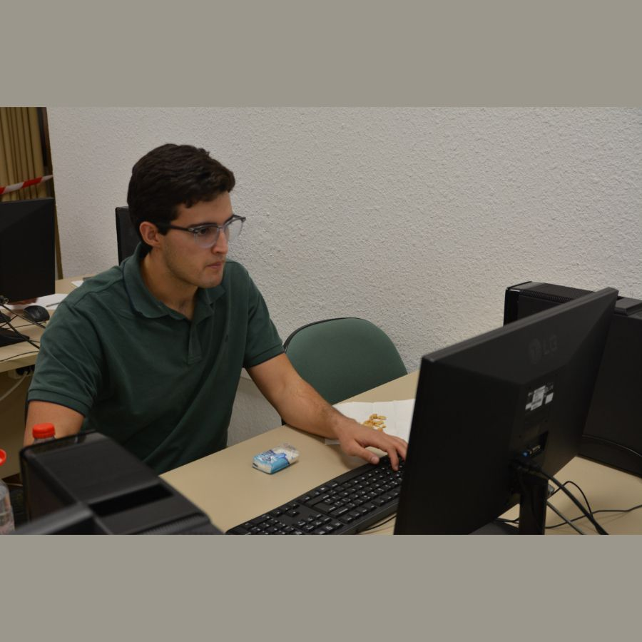
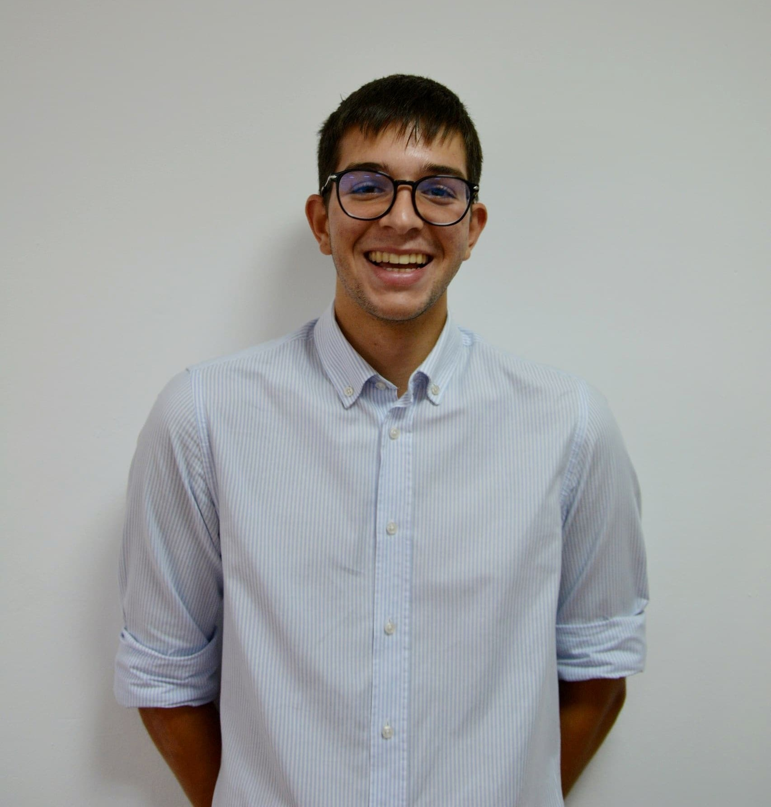
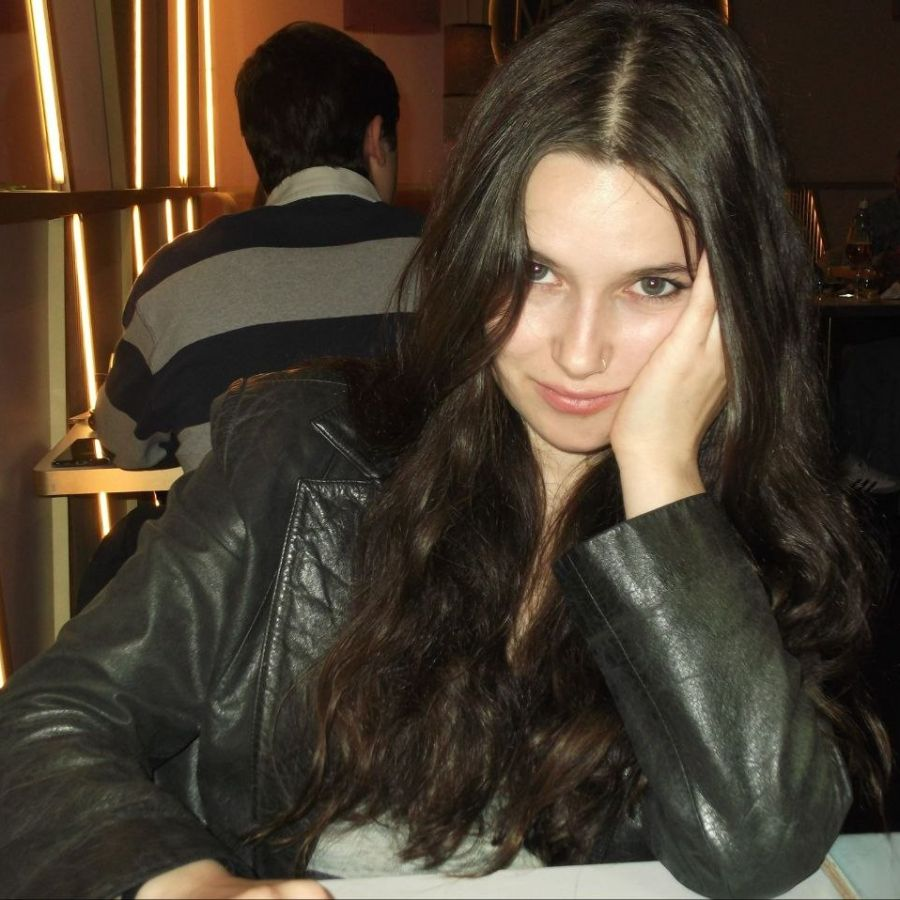
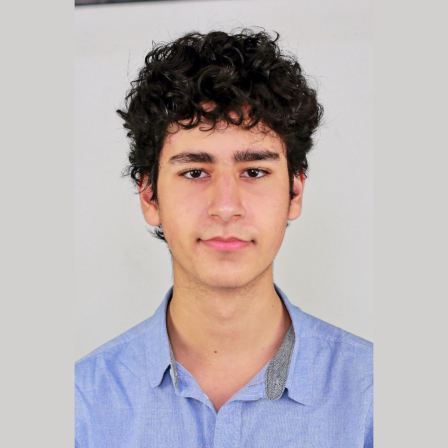
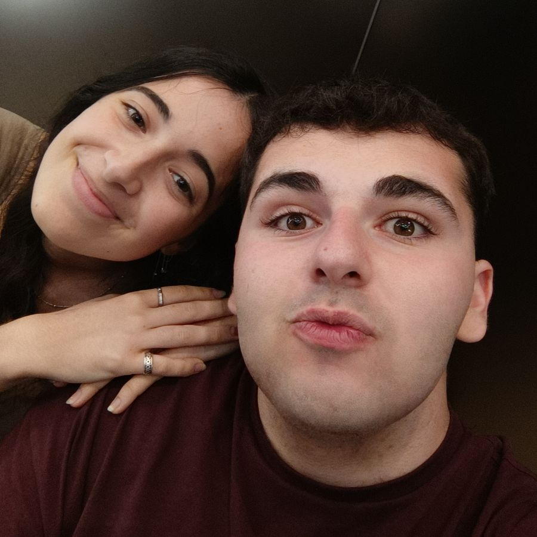

¡El Club de Algoritmia de la Universidad de Sevilla (CAUS) se prepara para un nuevo curso lleno de retos, aprendizaje y grandes competiciones! 🚀

Con el fin de seguir impulsando la algoritmia y la programación competitiva en la US, comienzan oficialmente las elecciones a admins del curso 2026-27. En esta edición contaremos con cargos fundamentales para la organización y el crecimiento continuo de la comunidad del club:

- **Problem Solvers:** encargados de preparar y dirigir las sesiones de entrenamiento, incluyendo diapositivas de teoría, problemas de todos los niveles y tutorización a los nuevos miembros.
- **Web Masters:** responsables del desarrollo, mantenimiento y optimización técnica de nuestra plataforma web [clubalgoritmiaus.es](https://clubalgoritmiaus.es). Además de llevar el canal de YouTube del club.
- **Marketing:** dinamizadores de las redes sociales del club (LinkedIn, WhatsApp, Instagram y X) y encargados de dar visibilidad al club e incentivar la participación.
- **Events Managers:** organizadores de competiciones, charlas con empresas, ponencias académicas, talleres interactivos y actividades sociales.

A continuación, os presentamos a los miembros del club que han dado un paso al frente para liderar el CAUS el año que viene. Os invitamos a conocer sus perfiles, ideas y motivaciones de cara a las próximas votaciones ¡El futuro del club quedará en sus manos!

  

    

      
      

        Problem Solver
      

    

    

      <h3 class="text-lg font-bold text-gray-900 dark:text-white leading-tight">Lorenzo Tagua Santana</h3>
      
Soy Lorenzo, me conocéis de haber estado dando clases sobre todo en el segundo cuatrimestre y de haber quedado 2º en el CompliCAUS y 1º en el Ada Byron de Andalucía junto a Julio Ojeda y Mario Mora en <em>TLE Climbers</em>.

      
Quiero continuar el año que viene en el club como problem solver, para poder echar una mano al club con los problemas semanales y ayudar a hacer que el CAUS vuelva a la cima del Ada Byron andaluz al igual que este año.

    

  

  

    

      
      

        Web Master
        Marketing
      

    

    

      <h3 class="text-lg font-bold text-gray-900 dark:text-white leading-tight">Alejandro Pineda Martín</h3>
      
Creo que puedo ser una buena incorporación porque me implico de verdad en lo que hago y no me limito a cumplir por cumplir.

      
Aunque no tenga mucha experiencia previa en algunos aspectos, tengo ganas de aprender y mejorar.

      
Además, al ser alguien que ya forma parte del entorno del club, entiendo cómo funciona y qué cosas se pueden mejorar, por lo que puedo adaptarme rápido y empezar a contribuir desde el principio.

    

  

  

    

      
      

        Problem Solver
      

    

    

      <h3 class="text-lg font-bold text-gray-900 dark:text-white leading-tight">Anselmo Jiménez Zambrano</h3>
      
¡Hola! Soy Anselmo, estudiante de Informática y Matemáticas. Me presento a Problem Solver con el objetivo de que todos podamos ganar seguridad a la hora de enfrentarnos a los problemas.

      
Así, mi propuesta es dar un enfoque más analítico a las clases: profundizar en los algoritmos y por qué funcionan permite poner en práctica estos conocimientos con mayor soltura. De esta manera, los más nuevos se formarán con una base sólida, mientras que los miembros experimentados podrán indagar más en temas más complejos.

      
Si me dais vuestra confianza, trabajaré para que aprendamos todos juntos, y así hagamos que nuestra Universidad se coloque cada vez más alto en los rankings de programación competitiva. ¡Muchas gracias por tomaros el tiempo de leerme y espero que podáis confiar en mí! :)

    

  

  

    

      
      

        Problem Solver
      

    

    

      <h3 class="text-lg font-bold text-gray-900 dark:text-white leading-tight">Jesús Racero San Román</h3>
      
Me presento a Problem Solver con el objetivo de ayudar en el CAUS a todo lo relacionado con la parte de las clases y aportar mi experiencia. Sé que hasta ahora no se me ha visto mucho por las clases debido a mi horario que era incompatible, pero estoy más que dispuesto a participar mucho más en estas el año que viene, ya que cambiará mi turno.

      
Creo que soy el mejor candidato al tener experiencia con la enseñanza y el trato de gente (ya sea en clases particulares u otros ámbitos) y por mis conocimientos en la programación competitiva, habiendo sido ganador de 3 de los 5 CompliCAUS que se han celebrado y habiendo obtenido el segundo puesto en el CompliCAUS IV.

    

  

  

    

      
      

        Web Master
        Problem Solver
      

    

    

      <h3 class="text-lg font-bold text-gray-900 dark:text-white leading-tight">Fernando Giráldez Curquejo</h3>
      
He mantenido la web del CAUS este último año, he actuado como problem solver y he ayudado a optimizar algunos procesos críticos del club. Este año vengo con muchísimas ganas de seguir aportando. 💻

      
Como Problem Solver, este último año me ha servido para ganar mucha experiencia compitiendo en el Ada Byron y organizando competiciones OIA. Quiero compartir todo lo que he aprendido en estos torneos y hackathons para que juntos sigamos reventando los rankings.

      
Como Web Master, aporto mi experiencia desarrollando aplicaciones reales a gran escala (como CTO en HomiMatch o creando PalistApp) para mantener y seguir modernizando la infraestructura del club. ¡Tengo muchas ganas de que sigamos construyendo cosas increíbles este año!

    

  

  

    

      
      

        Events Manager
      

    

    

      <h3 class="text-lg font-bold text-gray-900 dark:text-white leading-tight">Arnau Neches Vilà</h3>
      
Soy Arnau de quinto del doble en mates-info. Llevo en el CAUS desde el inicio (creo que la mayoría ya me conocéis). Mi objetivo como event manager es el siguiente:

      <ul style="list-style-type: disc; padding-left: 1.25rem; margin-bottom: 1rem;">
        <li><strong class="font-semibold text-gray-900 dark:text-white">5-10 charlas de empresas:</strong> Con posibilidad de intentar encontraros internships, etc.</li>
        <li><strong class="font-semibold text-gray-900 dark:text-white">5-10 charlas de profesores / profesionales / gente interesante en general:</strong> Cosas que estén chulas y nos gusten a todos.</li>
      </ul>
      
Quiero intentar hacer un evento cada dos semanas y tratar de dar la máxima visibilidad al CAUS (voy a obligar a todo el mundo que conozca a venir). Además de charlas, también he pensado en organizar algún evento social (los anglosajones hacen la típica de <em>pub crawl</em>, nosotros podemos hacer ruta de cerveza y tapas por el centro jeje, así como idea).

      
Me he hecho colega del event manager del club de business analytics de la UC3M y me va a pasar todos sus contactos (han hecho eventos tochos con Microsoft, Blackrock, HappyRobot, Oliver Wyman, IBM… etc). Será más complicado que vengan a Sevilla pero algún apaño haremos, jajaja.

      
¡Venga, votadme, sé que todos me queréis! 😉

    

  

  

    

      
      

        Web Master
        Problem Solver
        Events Manager
      

    

    

      <h3 class="text-lg font-bold text-gray-900 dark:text-white leading-tight">Pablo Moreno Moreu</h3>
      
¡Votadme mucho y así definitivamente no pondré un problema con el Simplex dual! 😜 Y para los que no me conozcan, pues soy Pablo (Moreno), parte del lema técnico, miembro del club desde el día 1 :D, un loco de las mates (y en general).

      
Ya va tocando aportar al club, así que me presento como problem solver para torturaros con problemas y hacer sesiones guapas. ¡En una de ellas vamos hasta a entender el repo de Miguel Toro!

      
Como veo que la gente se está vendiendo cara, pues yo también: ¡tengo casa en la playa! 🏖️

    

  

  

    

      
      

        Marketing
      

    

    

      <h3 class="text-lg font-bold text-gray-900 dark:text-white leading-tight">Julia Moreno Mejías</h3>
      
Hola chicos, soy Julia, me habréis visto estos últimos meses por el CAUS ya que me he encargado de daros globos y comida en el Ada Byron o también de tomaros fotos o vigilaros en el CompliCAUS V. La verdad es que soy una chica súper divertida (aunque Kenny y Fernando digan que no), muy alegre, y me encantaría formar parte del equipo de Marketing. ¡Muchas gracias! :D

    

  

  

    

      
      

        Problem Solver
        Events Manager
      

    

    

      <h3 class="text-lg font-bold text-gray-900 dark:text-white leading-tight">Victor Manuel Mesa Solano</h3>
      
Buenas!!!! Soy Víctor (con probabilidad cercana a 1 me habrás visto orbitando por Reina Mercedes, ya sea por la ETSII o divagando sobre Teoría Algebraica de Números con una intensidad masivamente innecesaria).

      
Para quienes no me conozcáis, ya fui admin el año pasado como Problem Solver y, si algo puedo prometer en esta candidatura, es implicación. Soy de esas personas a las que les gusta compilar ideas, no excusas, y creo que ese lema resume bastante bien cómo entiendo el club y cómo me gusta hacer las cosas.

      
Me gusta genuinamente el CAUS, tanto por la gente como por todo lo que se mueve alrededor. Me encanta meterme de lleno en lo que hago y, orgullosamente, creo que quienes me conocen saben del compromiso que he tenido con el club: dando sesiones, trayendo gente nueva o simplemente estando ahí para echar una mano...

      
Quiero repetir este año porque sinceramente creo que el CAUS tiene muchísimo potencial para seguir creciendo y llegar a aún más gente. Desde que entré he intentado traer al máximo número de personas posible, fomentar el buen rollo y hacer que cualquiera (desde quien empieza de cero hasta quien ya viene fortísimo) se sienta cómodo, motivado y con ganas de aprender. Y creo que algo de eso sí se ha conseguido: hemos crecido muchísimo, hay muy buen ambiente y siento que he podido aportar mi granito de arena (o más bien, mi montaña de yapping-maxing insistiendo a gente para que se pase por el club).

      
Pero no quiero quedarme solo en mantener lo que ya funciona. Mi idea es seguir mejorando las sesiones, proponer actividades nuevas, como fomentar la preparación para internships y oportunidades, charlas sobre temas más diversos como producción musical o hacer todavía más piña entre nosotros y conseguir que más personas se enganchen a este mundillo tan nice.

      
Ya en poco me callo, pero quería responderte a una pregunta que quizá no te has hecho, pero que considero crucial y es el: <em>“vale, pero ¿qué aportas?”</em> Buena pregunta. Lo resumiría en experiencia resolviendo problemas (no solo en algoritmia, también en la OME y la OEF), una forma cercana y práctica de enfocar las sesiones, humor (de calidad discutible, según el día) y muchísimas ganas de currar para que el club siga siendo un sitio donde aprender, mejorar y pasarlo bien. Además, conozco a bastante gente dentro y fuera de Reina Mercedes, así que si hay que mover personas (o si alguien quiere que le presente a alguien, también puedo intentar hacer magia), ideas o entusiasmo, ahí estaré.

      
En resumen: si queréis a alguien con ganas de trabajar, ideas, actividad constante y capacidad de convertir un <em>“no entiendo este problema”</em> en un <em>“vale, por fin entiendo de qué narices iba el segment tree”</em>, ¡aquí me tenéis! :)

    

  

  

    

      
      

        Marketing
        Problem Solver
      

    

    

      <h3 class="text-lg font-bold text-gray-900 dark:text-white leading-tight">Inés Dávila Herrero</h3>
      
¡¡Hola!! Soy Inés Dávila. Llevo siendo miembro del CAUS desde primero de bachillerato y este año he formado parte del grupo de admins. En este tiempo he conseguido premios en competiciones como la OIA, OIFem y Ada Byron.

      
Soy la loca que se pasó horas en la cocina para hacer más de 300 galletas para los CompliCAUS, ¡y que lo seguirá haciendo si salgo elegida de admin! Confío en vosotros. ¡Muchísimas gracias! 😊

    

  

  

    

      
      

        Problem Solver
        Events Manager
      

    

    

      <h3 class="text-lg font-bold text-gray-900 dark:text-white leading-tight">Julio Ojeda Infantes</h3>
      
La verdad es que después de lo que el club ha demostrado este año tanto en el Ada Byron como con la cantidad y calidad de charlas que organiza, el listón está muy alto.

      
Por mi parte me gustaría poner mi granito de arena en este equipo y ayudar con la organización de las sesiones, proponiendo problemas de todos los niveles para que todos podamos crecer tanto de cara a futuras competiciones como a nivel profesional.

    

  

  

    

      
      

        Marketing
        Problem Solver
      

    

    

      <h3 class="text-lg font-bold text-gray-900 dark:text-white leading-tight">Miguel Antequera Gaspar</h3>
      
Creo que podría ser un buen candidato porque me implicaría al máximo en todas las tareas que conlleve mi cargo. Me gustaría generar en otros la ilusión y las ganas que en mí me han generado los anteriores administradores durante el curso pasado.

      
Creo que sería una persona adecuada por mis ganas de aprender y de que otros aprendan.

    

  

  

    

      
      

        Marketing
      

    

    

      <h3 class="text-lg font-bold text-gray-900 dark:text-white leading-tight">Araceli Guerrero Morato</h3>
      
Me presento a marketing porque creo que puedo ayudar a que el CAUS tenga más visibilidad y llegue a más gente. Aunque no he ido como miembro habitual, sí he estado en las últimas competiciones haciendo fotos y vídeos, así que algunos igual me ubicáis de estar por allí con la cámara y los globitos. 📸🎈

      
Me gustaría aportar con contenido, redes y difusión para enseñar mejor las competiciones, actividades y el ambiente del club.

      
Tengo muchas ganas de implicarme y ayudar a que más gente vea lo chulo que puede ser formar parte del CAUS. Y bueno, ya que estamos… ¡votadme! :)

    

  

¡Mucha suerte a todos los candidatos! Vuestro compromiso e implicación es lo que hace grande a esta asociación ✨

    
      <a href="https://docs.google.com/forms/d/e/1FAIpQLSe1As5n7InsNaXy4Ge3M0dn8sWyOob1MqpgkcRWAZlgg1cpFg/viewform?usp=publish-editor" style="font-weight: 800; text-decoration: none;">
        Vota aquí
      </a>
    

