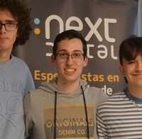
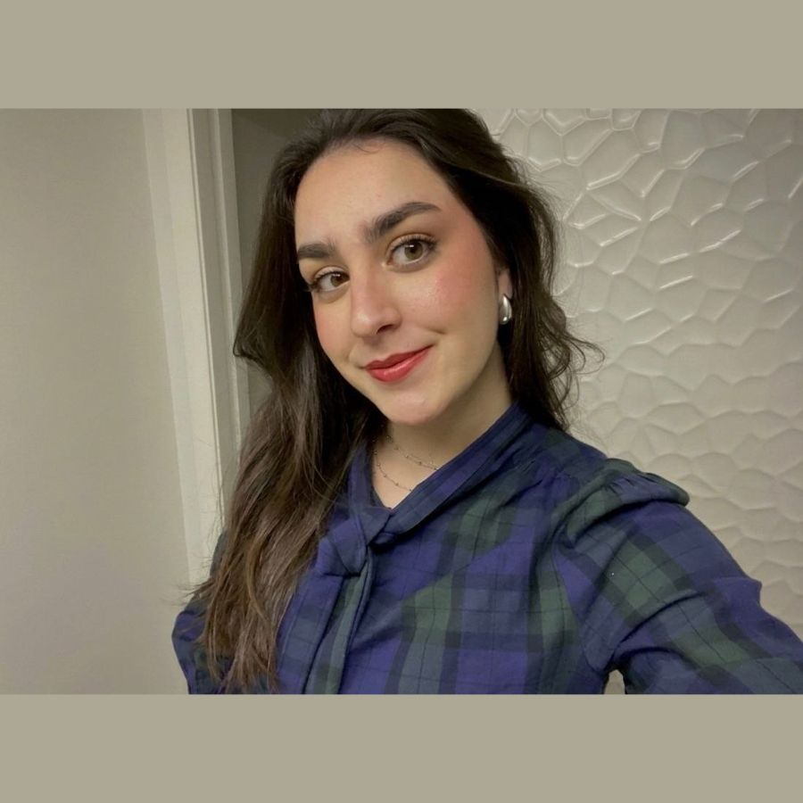
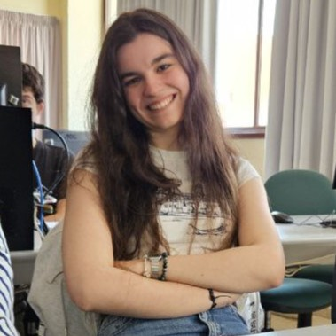
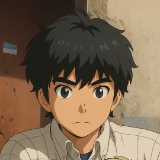
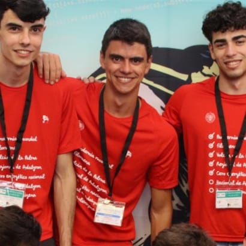
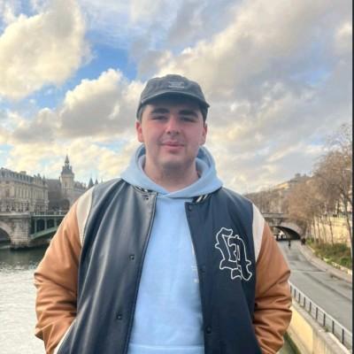
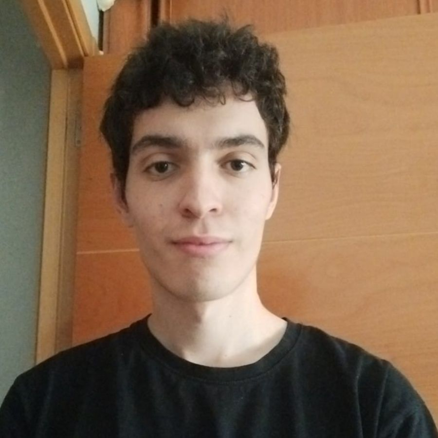
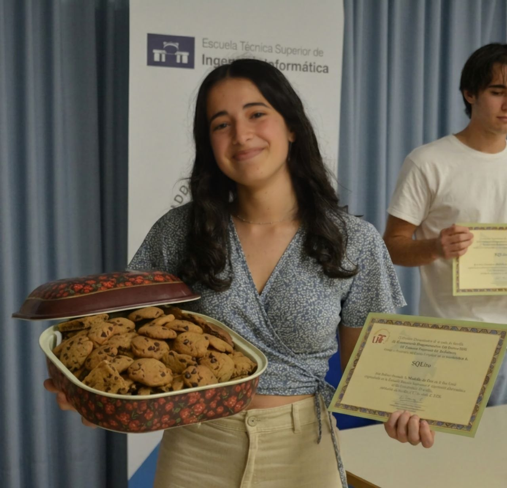
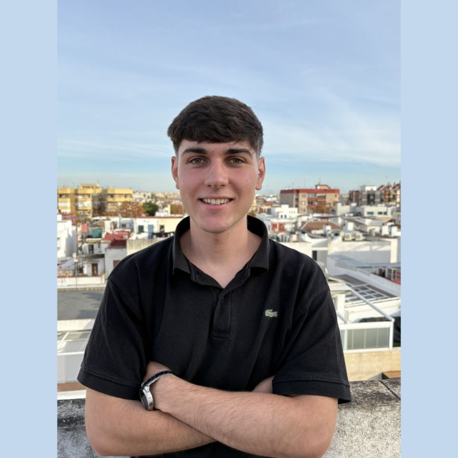
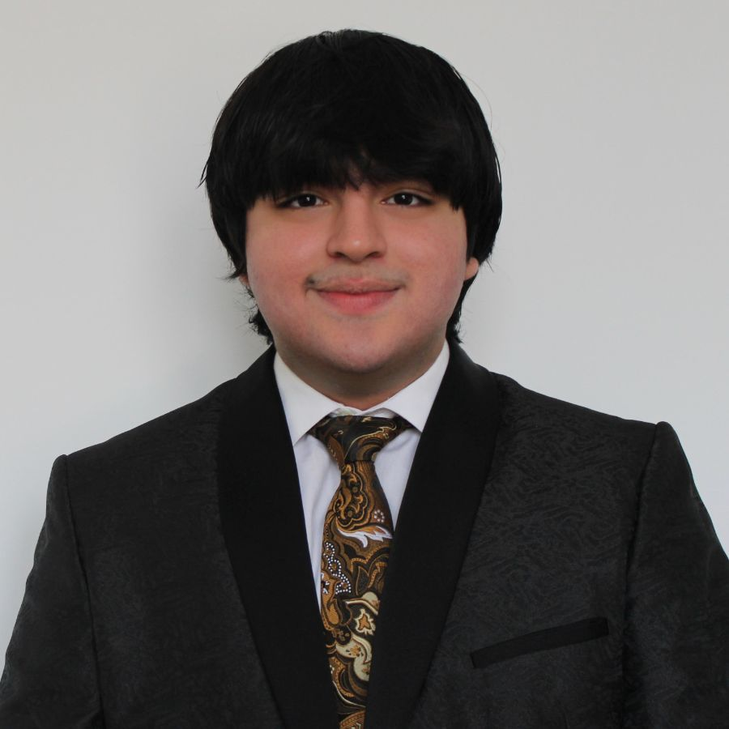

En las elecciones del Club de Algoritmia de la Universidad de Sevilla (CAUS) para el curso 2026-2027 han participado un total de 30 miembros. Queremos dar las gracias a todos por la implicación y por seguir haciendo crecer el club, ya que este año hemos vuelto a aumentar la participación respecto al anterior, algo que nos alegra especialmente.

En lo que respecta a la presidencia y vicepresidencia, ambos cargos continúan igual que el curso pasado:

- Pablo Reina (Presidente)
- Kenny Flores (Vicepresidente)

A continuación se detalla cómo han quedado el resto de equipos para este nuevo curso.

### 👨‍💻 Web Masters

Este equipo se encarga de dar soporte al desarrollo de la web del club y de ayudar con la gestión del canal de YouTube. Este año, las personas elegidas han sido:

  

    
    
Alejandro Pineda

    

      Estudiante de GII – Tecnologías Informáticas
    

  

  

    
    
Fernando Giráldez

    

      Estudiante de GII – Ingeniería de Computadores
    

  

### Marketing

El área de Marketing inicia este año una nueva etapa con el objetivo de reforzar la presencia del club en redes sociales y dar más visibilidad a todas las actividades. Además de Kenny, contará también con una nueva admin que apoyará en la coordinación del área.

  

    
    
Julia Moreno 

    

      Estudiante de bachillerato
    

  

Además, contaremos también con un grupo de colaboradores que apoyarán en eventos y en la gestión de redes sociales. Por ahora, este equipo estará formado por:

  

    
    
Araceli Guerrero 

  

   

    
    
Lucía Campos 

  

   

    
    
Luis Castillo 

  

### Problem Solvers

Una de las categorías más disputadas cada año. En esta ocasión, el objetivo es dar un salto de nivel en las sesiones y preparar entrenamientos más exigentes para seguir mejorando de cara a futuras competiciones. El equipo queda formado por:

  

    
    
Lorenzo Tagua 

    

      Estudiante de Ingeniería Industrial
    

  

  

    
    
Julio Ojeda 

    

      Estudiante de matemáticas
    

  

    
    
Anselmo Jiménez  

    

      Estudiante de GII – Tecnologías Informáticas y Matemáticas
    

  

    
    
Pablo Moreno  

    

      Estudiante de GII – Tecnologías Informáticas y Matemáticas
    

  

    
    
Miguel Antequera

    

      Estudiante de Matemáticas y Física
    

  

    
    
Jesús Racero 

    

      Estudiante de Ingeniería de Software
    

  

    
    
Inés Dávila  

    

      Estudiante de GII - Inteligencia Artificial
    

  

### Events Managers

Este año este rol cobra especial importancia, ya que con la salida de Pablo Dávila rumbo a Berkeley se abre una nueva etapa en la organización de eventos del club. El equipo encargado será:

  

    
    
Arnau Neches

    

      Estudiante de GII – Tecnologías Informáticas y Matemáticas
    

  

  

    
    
Victor Mesa

    

      Estudiante de Matemáticas y Estadística
    

  

### Despedidas

Queremos dedicar unas palabras de agradecimiento a quienes dejan sus puestos este año:

- **Jose Garcia De Tejada Delgado**

💙 Desde el club queremos agradecerle su trabajo y su apoyo durante estos años. Ha sido una pieza importante en el crecimiento del CAUS, especialmente por ser el primer administrador no fundador en unirse al equipo.
