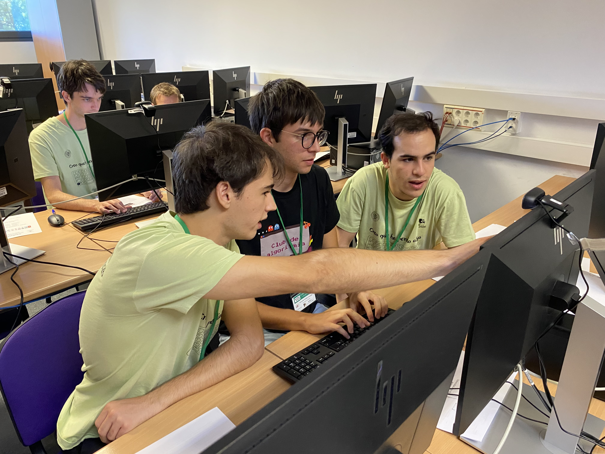
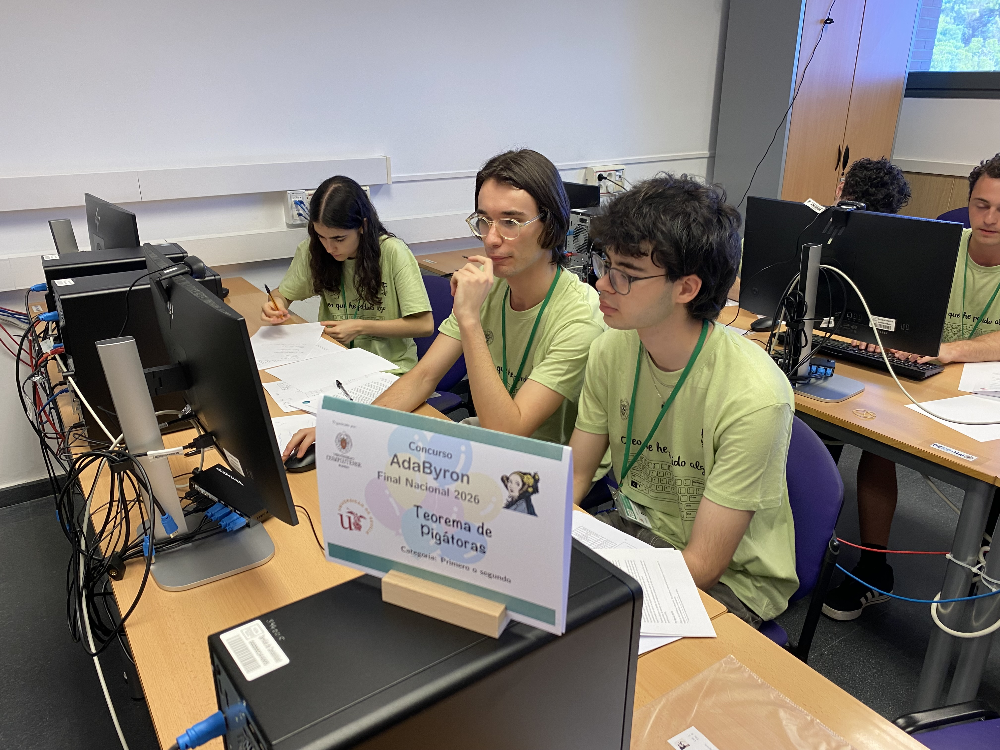
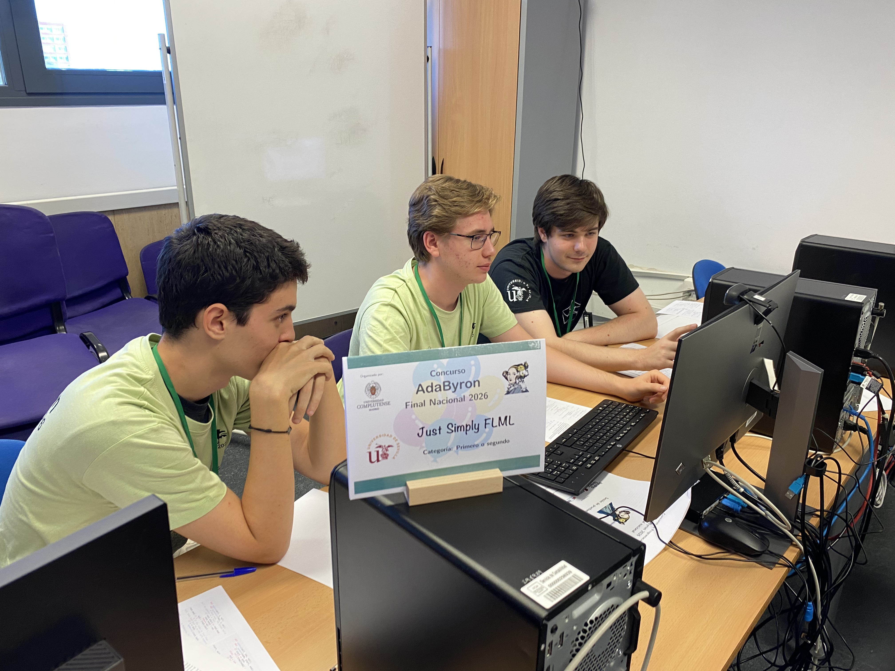
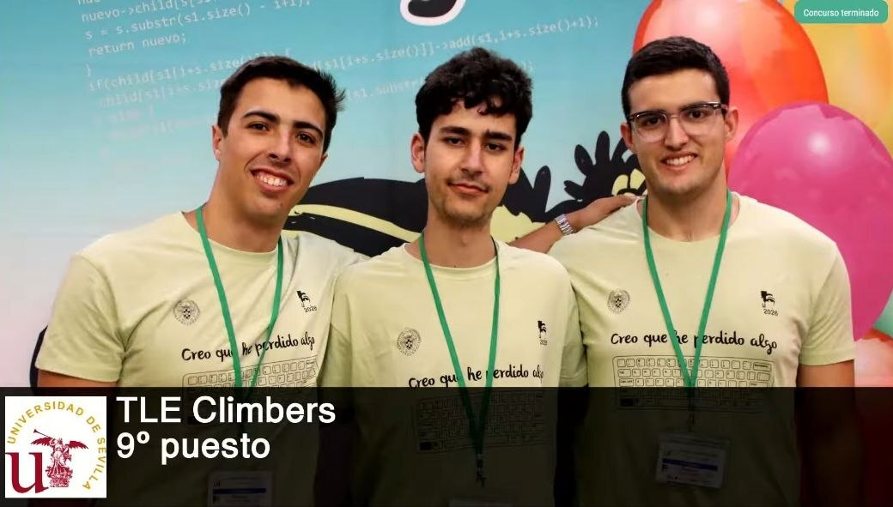

Los pasados **3 y 4 de julio de 2026** se celebró la **XII Final Nacional del Concurso Ada Byron** en la Facultad de Informática de la Universidad Complutense de Madrid, donde se reunieron los mejores equipos clasificados en las distintas fases regionales del concurso. En esta edición participaron **42 equipos procedentes de 23 universidades españolas**, consolidando una vez más el Ada Byron como una de las competiciones universitarias de programación más importantes del país. La Universidad de Sevilla estuvo representada por cuatro equipos del CAUS, entre los que destacó **TLE Climbers**, que logró finalizar en una meritoria **novena posición**, situándose entre los diez mejores equipos de la competición.

# Equipos del CAUS

En esta edición, **cuatro equipos** pertenecientes al Club de Algoritmia de la Universidad de Sevilla lograron clasificarse para la final nacional. Además de ellos, los administradores que asistimos como entrenadores también participamos en una competición paralela para *coaches*, resolviendo el mismo conjunto de problemas que los participantes mientras competíamos con los entrenadores del resto de universidades.

## Equipo **"SQLito"**

- **Fernando Giráldez Curquejo** (Grado en Ingeniería Informática – Ingeniería del Software)
- **Lucas Franco Borrero** (Grado en Ingeniería Informática – Ingeniería del Software)
- **Joaquín González** (Grado en Ingeniería Informática – Ingeniería del Software)

## Equipo **"Teorema de Pigátoras"**

- **Anselmo Jiménez Zambrano** (Grado en Ingeniería Informática – Ingeniería del Software)
- **Irene Gutiérrez Enguix** (Grado en Ingeniería Informática – Ingeniería del Software)
- **Javier Giménez Cabanillas** (Grado en Ingeniería Informática – Ingeniería del Software)

## Equipo **"Just Simply FLML"**

- **Jesús Racero San Román** (Grado en Ingeniería Informática – Ingeniería del Software)
- **Jesús Vílchez Martínez** (Grado en Ingeniería Informática – Ingeniería del Software)
- **José Escalera García** (Grado en Ingeniería Informática – Ingeniería del Software)

## Equipo **"TLE Climbers"**

- **Julio Ojeda Infantes** (Grado en Ingeniería Informática – Ingeniería del Software)
- **Lorenzo Tagua Santana** (Grado en Ingeniería Informática – Ingeniería del Software)
- **Mario Mora Cortés** (Grado en Ingeniería Informática – Ingeniería del Software)
- **Javier Giménez Cabanillas** (Grado en Ingeniería Informática – Ingeniería del Software)

# Resultados y agradecimientos

Durante las **5 horas de competición**, los equipos se enfrentaron a la resolución de un exigente conjunto de problemas algorítmicos, demostrando un gran nivel técnico y de trabajo en equipo.

El mejor resultado de la delegación sevillana fue el obtenido por **TLE Climbers**, que alcanzó la **novena posición** de la clasificación general, situándose entre los diez mejores equipos de España en esta edición del concurso. Este resultado supone un excelente reconocimiento al trabajo realizado por el equipo y refleja el alto nivel alcanzado por los estudiantes del Club de Algoritmia de la Universidad de Sevilla.

Finalmente, desde el **CAUS** queremos felicitar a todos nuestros participantes por el esfuerzo y dedicación demostrados durante toda la temporada. También queremos expresar nuestro agradecimiento a la **Escuela Técnica Superior de Ingeniería Informática de la Universidad de Sevilla** por patrocinar el viaje a Madrid de nuestros equipos, a los organizadores del Concurso Ada Byron por hacer posible una nueva edición de la final nacional y a todas las entidades patrocinadoras que contribuyen al éxito del evento.